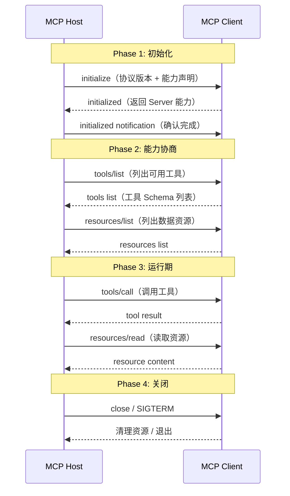

> 本文是 Agent 协议系列的第二篇，前篇《[Function Calling 诞生的背景](/blog/2026/07/14/function-calling-background)》探讨了函数调用能力的起源，本篇聚焦更通用的协议层——MCP。

## 为什么需要 MCP？

Function Calling 解决了「LLM 如何调用外部函数」的问题，但它有一个根本性局限：**每个模型厂商的函数定义格式不同**。OpenAI 有 `tools` 参数，Anthropic 用 `tools` 但 schema 略有差异，Google Gemini 用 `tools` / `tool_config`，Llama 系列模型需要特定的 prompt 模板。

这意味着你的工具代码需要为每个模型写一个适配层。更麻烦的是，**工具本身的注册、发现、安全策略**并没有一个统一的标准——每个 Agent 框架都在自己造轮子。

**MCP（Model Context Protocol）** 就是来解决这个问题的。它由 Anthropic 提出，本质上是一个**通用的、模型无关的上下文与工具交互协议**，定义了 LLM 应用与外部工具/数据源之间的标准通信方式。

{/* truncate */}

## MCP 的架构设计

### 核心角色

MCP 的架构围绕两个角色展开：

```
┌─────────────────┐       MCP Protocol       ┌─────────────────┐
│                 │ ◄═══════════════════════► │                 │
│   MCP Host      │                           │   MCP Client    │
│  (LLM App)      │     JSON-RPC 2.0          │  (Tool Server)  │
│                 │     over SSE/Stdio        │                 │
└─────────────────┘                           └─────────────────┘
```

| 角色 | 职责 | 示例 |
|------|------|------|
| **MCP Host** | LLM 应用本身，负责协调对话与工具调用 | Claude Desktop、Cursor、自定义 Agent |
| **MCP Client** | 实际提供工具/数据的服务器进程 | 文件系统工具、数据库查询器、Web 搜索 |

关键的设计决策：**MCP 采用客户端-服务器模式，而不是嵌入模式**。工具运行在独立的进程中，与 LLM 应用通过标准协议通信。这带来了几个重要优势：

1. **安全隔离**：工具代码运行在独立进程中，LLM 无法直接操作宿主环境
2. **语言无关**：Server 可以用 Python、Go、Rust 等任意语言实现
3. **独立生命周期**：工具可以独立部署、升级、扩缩容
4. **统一接口**：无论底层工具是什么，暴露给 LLM 的都是统一协议

### 传输层

MCP 定义了两种传输方式，覆盖本地和远程场景：

#### Stdio 传输（本地进程通信）

Host 以子进程方式启动 Client，通过 stdin/stdout 通信：

```python
# Host 端伪代码
import subprocess
import json

class StdioTransport:
    def __init__(self, server_command: list[str]):
        self.process = subprocess.Popen(
            server_command,
            stdin=subprocess.PIPE,
            stdout=subprocess.PIPE,
            stderr=subprocess.PIPE,  # 日志走 stderr，协议走 stdout
        )

    def send_request(self, method: str, params: dict) -> dict:
        request = {
            "jsonrpc": "2.0",
            "id": 1,
            "method": method,
            "params": params,
        }
        self.process.stdin.write(json.dumps(request).encode() + b"\n")
        self.process.stdin.flush()
        response = json.loads(self.process.stdout.readline())
        return response["result"]

    def close(self):
        self.process.terminate()
        self.process.wait()
```

Stdio 适合**本地开发、单机部署**，优点是零网络开销、低延迟。缺点是无法跨机器访问。

#### SSE 传输（远程通信）

Host 通过 HTTP SSE（Server-Sent Events）与远程 Server 通信：

```python
import httpx
import json

class SSETransport:
    def __init__(self, server_url: str):
        self.server_url = server_url
        self.client = httpx.Client()

    def list_tools(self) -> list[dict]:
        """通过 GET /mcp/tools 获取工具列表"""
        response = self.client.get(f"{self.server_url}/mcp/tools")
        return response.json()["tools"]

    def call_tool(self, name: str, args: dict) -> dict:
        """通过 POST /mcp/call 调用工具"""
        response = self.client.post(
            f"{self.server_url}/mcp/call",
            json={"name": name, "arguments": args},
        )
        return response.json()

    def subscribe_events(self, callback):
        """通过 SSE 订阅服务端事件"""
        with self.client.stream(
            "GET", f"{self.server_url}/mcp/events"
        ) as stream:
            for event in stream.iter_lines():
                callback(json.loads(event))
```

SSE 适合**分布式部署**：工具可以独立运行在远程服务器上，Host 通过网络调用。延迟比 Stdio 稍高，但带来了部署灵活性。

### 协议消息格式

MCP 基于 JSON-RPC 2.0，所有消息分为三类：

```jsonc
// 1. Request（请求）
{
  "jsonrpc": "2.0",
  "id": 1,
  "method": "tools/call",
  "params": {
    "name": "read_file",
    "arguments": {"path": "/home/user/config.json"}
  }
}

// 2. Response（响应）  
{
  "jsonrpc": "2.0",
  "id": 1,
  "result": {
    "content": [
      {"type": "text", "text": "file content here..."}
    ],
    "is_error": false
  }
}

// 3. Notification（通知，无需响应）
{
  "jsonrpc": "2.0",
  "method": "notifications/initialized",
  "params": {}
}
```

### 生命周期

一个 MCP 连接的标准生命周期分为三个阶段：



## 工具定义与编排

### 工具 Schema

MCP 的工具定义遵循 JSON Schema，但限制更严格以确保 LLM 能稳定解析：

```jsonc
{
  "name": "search_codebase",
  "description": "在代码仓库中进行语义搜索，返回匹配的代码片段及其文件路径",
  "inputSchema": {
    "type": "object",
    "properties": {
      "query": {
        "type": "string",
        "description": "搜索查询，支持自然语言描述。例如：'处理用户登录的函数'"
      },
      "max_results": {
        "type": "integer",
        "description": "最大返回结果数",
        "default": 10,
        "minimum": 1,
        "maximum": 50
      },
      "file_pattern": {
        "type": "string",
        "description": "可选的 glob 过滤，如 '*.py' 或 'src/**/*.ts'"
      }
    },
    "required": ["query"]
  }
}
```

**MCP 的工具定义与 OpenAI Function Calling 的 `parameters` 有何不同？**

| 维度 | OpenAI Function Calling | MCP |
|------|------------------------|-----|
| Schema 位置 | 嵌套在 `tools.function.parameters` | 顶层 `inputSchema` |
| `required` | 位于 `parameters.required` | 位于 `inputSchema.required` |
| 描述字段 | `function.description` 在外层 | `description` 在工具级 |
| 严格模式 | 需设置 `strict: true` | 默认严格 |
| 结果格式 | 自由格式 `content` | 统一 `content[]` 数组 |
| 多内容类型 | 仅文本 | text、image、resource、embedded 等多类型 |

### 资源与提示模板

MCP 不只是「工具调用」，它还抽象了另外两种概念：

**资源（Resource）**：可被 LLM 读取的数据源，类似文件系统中的「文件」：

```jsonc
{
  "uri": "file:///home/user/project/README.md",
  "name": "项目 README",
  "description": "当前项目的 README 文档",
  "mimeType": "text/markdown",
  "size": 1234
}
```

资源通过 `resources/list` 发现，通过 `resources/read` 读取。不同于工具（执行操作），资源只提供数据。

**提示模板（Prompt Template）**：预定义的对话模板，帮助 LLM 处理特定场景：

```jsonc
{
  "name": "review_code",
  "description": "对代码进行 Code Review",
  "arguments": [
    {"name": "code", "description": "待审查的代码", "required": true},
    {"name": "language", "description": "编程语言", "required": false}
  ]
}
```

这种「工具 + 资源 + 模板」的三元组设计，使得 MCP 不仅是函数调用协议，而是一个**完整的上下文交互协议**。

### 工具编排策略

在实际的 Agent 应用中，工具不是越多越好。MCP 的最佳实践建议：

**1. 按域分组（Domain Grouping）**

不要把所有工具放到一个 Server 里：

```python
# ❌ 不好的做法：一个 Server 注册所有工具
server = MCPServer("monolith")
server.register_tool(read_file)
server.register_tool(query_database)
server.register_tool(send_email)
server.register_tool(deploy_service)

# ✅ 好的做法：按职责拆分
file_server = MCPServer("filesystem", ["read_file", "write_file", "list_dir"])
db_server = MCPServer("database", ["query", "execute_sql", "describe_table"])
ops_server = MCPServer("operations", ["deploy", "restart", "rollback"])
```

分组的好处：
- LLM 只需加载相关领域的工具，减少 token 消耗
- 每个 Server 可以独立配置权限策略
- 故障隔离：一个 Server 崩溃不影响其他

**2. 工具粒度控制**

```python
# ❌ 过于细粒度——LLM 需要多次调用才能完成一件事
tools = ["read_file", "parse_json", "extract_field", "filter_data", "aggregate"]

# ✅ 合理粒度——将常见组合封装成单一工具
tools = ["analyze_data_file"]
```

**3. 安全边界**

使用 MCP 的**能力声明（Capabilities）** 机制限制 Server 权限：

```python
# Host 端声明可用的能力
capabilities = {
    "tools": {
        "supported_methods": ["tools/list", "tools/call"],
        "max_tool_results": 100,
    },
    "resources": {
        "supported_methods": ["resources/list", "resources/read"],
        "max_resource_size": 1024 * 1024,  # 1MB
    },
    "experimental": {
        "streaming": True,  # 支持流式响应
    }
}
```

## 生产级 MCP 实现

### 用 Python 实现一个 MCP Server

以下是一个完整的文件搜索工具 Server，展示 MCP 的核心实现模式：

```python
import json
import subprocess
import sys
from pathlib import Path
from typing import Any


class MCPServer:
    """MCP 协议 Server 实现"""

    def __init__(self, name: str):
        self.name = name
        self.tools: dict[str, dict] = {}
        self.request_id = 0

    def register_tool(self, func, schema: dict):
        """注册一个工具"""
        self.tools[schema["name"]] = {
            "func": func,
            "schema": schema,
        }

    def handle_request(self, request: dict) -> dict:
        """处理单个 JSON-RPC 请求"""
        method = request["method"]
        params = request.get("params", {})
        req_id = request["id"]

        if method == "initialize":
            return {
                "jsonrpc": "2.0",
                "id": req_id,
                "result": {
                    "protocolVersion": "2025-03-26",
                    "capabilities": {
                        "tools": {
                            "supported": True,
                        }
                    },
                    "serverInfo": {
                        "name": self.name,
                        "version": "1.0.0",
                    },
                },
            }

        elif method == "tools/list":
            return {
                "jsonrpc": "2.0",
                "id": req_id,
                "result": {
                    "tools": [t["schema"] for t in self.tools.values()],
                },
            }

        elif method == "tools/call":
            tool_name = params["name"]
            arguments = params.get("arguments", {})

            if tool_name not in self.tools:
                return {
                    "jsonrpc": "2.0",
                    "id": req_id,
                    "error": {
                        "code": -32601,
                        "message": f"Tool not found: {tool_name}",
                    },
                }

            try:
                result = self.tools[tool_name]["func"](**arguments)
                return {
                    "jsonrpc": "2.0",
                    "id": req_id,
                    "result": {
                        "content": [
                            {"type": "text", "text": json.dumps(result)}
                        ],
                        "is_error": False,
                    },
                }
            except Exception as e:
                return {
                    "jsonrpc": "2.0",
                    "id": req_id,
                    "result": {
                        "content": [
                            {
                                "type": "text",
                                "text": json.dumps({"error": str(e)}),
                            }
                        ],
                        "is_error": True,
                    },
                }

        else:
            return {
                "jsonrpc": "2.0",
                "id": req_id,
                "error": {
                    "code": -32601,
                    "message": f"Method not found: {method}",
                },
            }

    def run_stdio(self):
        """通过 stdin/stdout 运行"""
        for line in sys.stdin:
            request = json.loads(line.strip())
            response = self.handle_request(request)
            sys.stdout.write(json.dumps(response) + "\n")
            sys.stdout.flush()

    def run_http(self, host: str = "0.0.0.0", port: int = 8000):
        """通过 HTTP SSE 运行"""
        from http.server import HTTPServer, BaseHTTPRequestHandler

        class MCPHandler(BaseHTTPRequestHandler):
            server_ref = self

            def do_GET(self):
                if self.path == "/mcp/tools":
                    tools = server_ref.handle_request({
                        "id": 1,
                        "method": "tools/list",
                        "params": {},
                    })
                    self.send_response(200)
                    self.send_header("Content-Type", "application/json")
                    self.end_headers()
                    self.wfile.write(json.dumps(tools).encode())

                elif self.path == "/mcp/events":
                    self.send_response(200)
                    self.send_header("Content-Type", "text/event-stream")
                    self.send_header("Cache-Control", "no-cache")
                    self.end_headers()
                    # 实际实现中应推送事件
                    self.wfile.write(b"data: {}\n\n")

            def do_POST(self):
                if self.path == "/mcp/call":
                    length = int(self.headers["Content-Length"])
                    body = json.loads(self.rfile.read(length))
                    result = server_ref.handle_request({
                        "id": body.get("id", 1),
                        "method": "tools/call",
                        "params": {
                            "name": body["name"],
                            "arguments": body.get("arguments", {}),
                        },
                    })
                    self.send_response(200)
                    self.send_header("Content-Type", "application/json")
                    self.end_headers()
                    self.wfile.write(json.dumps(result).encode())

        server = HTTPServer((host, port), MCPHandler)
        print(f"MCP Server running on http://{host}:{port}")
        server.serve_forever()


# === 注册具体的工具 ===

def search_files(query: str, root_dir: str = ".", max_results: int = 10):
    """搜索文件内容"""
    results = []
    for path in Path(root_dir).rglob("*"):
        if path.is_file() and path.stat().st_size < 1024 * 100:
            try:
                content = path.read_text(errors="ignore")
                if query.lower() in content.lower():
                    results.append(str(path))
                    if len(results) >= max_results:
                        break
            except Exception:
                continue
    return {"matched_files": results, "total": len(results)}


if __name__ == "__main__":
    server = MCPServer("file-search-server")
    server.register_tool(
        search_files,
        {
            "name": "search_files",
            "description": "在目录中搜索包含指定关键词的文件",
            "inputSchema": {
                "type": "object",
                "properties": {
                    "query": {
                        "type": "string",
                        "description": "搜索关键词",
                    },
                    "root_dir": {
                        "type": "string",
                        "description": "搜索根目录",
                        "default": ".",
                    },
                    "max_results": {
                        "type": "integer",
                        "maximum": 50,
                        "default": 10,
                    },
                },
                "required": ["query"],
            },
        },
    )
    server.run_stdio()
```

### Host 端集成

Host 端需要将 MCP 的工具列表转换成 LLM 能理解的格式：

```python
import json


class MCPHost:
    """MCP Host 端实现"""

    def __init__(self, servers: list[MCPServer]):
        self.servers = servers

    def get_all_tools(self) -> list[dict]:
        """合并所有 Server 的工具列表"""
        all_tools = []
        for server in self.servers:
            # 实际中通过协议获取
            server_tools = server.handle_request({
                "id": 1,
                "method": "tools/list",
                "params": {}
            })
            all_tools.extend(server_tools["result"]["tools"])
        return all_tools

    def convert_to_openai_format(self) -> list[dict]:
        """将 MCP 工具转换为 OpenAI tools 格式"""
        mcp_tools = self.get_all_tools()
        openai_tools = []

        for tool in mcp_tools:
            openai_tools.append({
                "type": "function",
                "function": {
                    "name": tool["name"],
                    "description": tool["description"],
                    "parameters": tool["inputSchema"],
                },
            })

        return openai_tools

    def convert_to_anthropic_format(self) -> list[dict]:
        """将 MCP 工具转换为 Anthropic tools 格式"""
        mcp_tools = self.get_all_tools()
        anthropic_tools = []

        for tool in mcp_tools:
            anthropic_tools.append({
                "name": tool["name"],
                "description": tool["description"],
                "input_schema": tool["inputSchema"],
            })

        return anthropic_tools
```

这种**格式转换层**就是 MCP 的核心价值——你的工具只用实现 MCP 协议一次，就能被任何支持 MCP 的 LLM 应用使用。

## 性能与可靠性考量

### 延迟优化

| 场景 | Stdio | SSE (localhost) | SSE (远程) |
|------|-------|-----------------|-----------|
| 首次调用 | ~5ms | ~1ms | ~50ms |
| 持续调用 | ~2ms | ~0.5ms | ~30ms |
| 结果传输 (1MB) | ~8ms | ~12ms | ~200ms |

对于延迟敏感的场景，建议：
- **本地工具优先用 Stdio**：避免 HTTP 开销
- **远程工具用连接池**：复用 HTTP 连接，减少 TLS 握手
- **大结果用流式传输**：MCP 支持 `tools/call` 的流式返回，允许 LLM 边接收边处理

### 错误处理模式

```python
# 健壮的错误处理
def call_tool_with_retry(host, tool_name, args, max_retries=3):
    last_error = None
    for attempt in range(max_retries):
        try:
            result = host.call_tool(tool_name, args)
            if result.get("is_error"):
                # Server 端逻辑错误，重试无意义
                return result
            return result
        except ConnectionError as e:
            # 网络问题，可以重试
            last_error = e
            time.sleep(0.5 * (2 ** attempt))  # 指数退避
        except TimeoutError as e:
            # 超时，可以重试
            last_error = e
            time.sleep(1.0)

    return {
        "content": [{"type": "text", "text": str(last_error)}],
        "is_error": True,
    }
```

### 安全最佳实践

1. **最小权限原则**：每个 MCP Server 只暴露它必需的工具
2. **路径限制**：文件操作类工具需要做路径校验，防止路径穿越
3. **速率限制**：在 Server 端限制 `tools/call` 的调用频率
4. **结果大小限制**：限制 `content` 的最大大小，防止 LLM 上下文被撑爆
5. **超时控制**：每个工具调用设置超时，防止死耗

## MCP 的生态与未来

截至 2026 年中，MCP 已经有了相当可观的生态：

- **IDE 集成**：Cursor、VS Code 扩展、JetBrains 插件均已支持
- **框架支持**：LangChain、LlamaIndex、AutoGen 都有 MCP 适配器
- **云服务**：AWS Bedrock、GCP Vertex AI 开始原生支持 MCP
- **开源 Server 市场**：GitHub 上有 1000+ 个 MCP Server 实现

MCP 的下一阶段演进方向包括：
- **双向流式通信**：Server 可以主动向 Host 推送事件
- **工具发现 SSDP**：类似 mDNS 的服务发现机制
- **联邦工具调用**：多个 Host 可以共享工具注册表
- **多模态扩展**：原生支持图片、音频、视频类型的工具结果

## 总结

MCP 不是另一个「框架」，它是一个**协议层标准**。就像 HTTP 解耦了 Web 客户端和服务器一样，MCP 解耦了 LLM 应用和工具提供方。

核心收获：
- MCP 的角色设计（Host/Client）提供了清晰的安全边界
- Stdio + SSE 两种传输方式覆盖了本地和远程场景
- 工具 + 资源 + 提示模板的三元组设计超越了传统的 Function Calling
- 按域分组的工具编排策略能有效降低 token 消耗
- MCP 的格式转换层使得一次实现、多模型兼容成为可能

**相关阅读：**
- [Function Calling 诞生的背景](/blog/2026/07/14/function-calling-background)
- [Function Calling 实践指南](/blog/2026/07/23/function-calling-implementation-guide)
- [利用工具与 MCP 扩展 LLM 能力](/blog/2026/07/23/extending-llm-capabilities)
