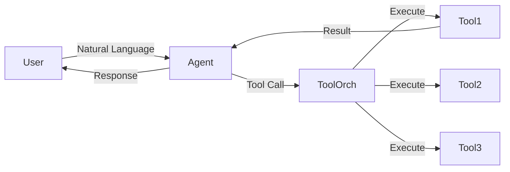

# AI Agent 安全架构深度剖析：从 ToolGuardian 到 Agent-Tool 交互防护

## 引言

2026 年 7 月，OpenAI 的 Hugging Face 账号被入侵事件再次将 AI 安全推上风口浪尖。这场风波不仅暴露了 API 密钥管理的脆弱性，更引发了一个更深层的讨论：**当 AI Agent 被授权调用外部工具时，我们如何在功能与安全之间找到平衡？**

随着 Agent 架构从简单的 ReAct 模式演变为多工具、多步骤的复杂工作流，Tool-Use 的攻击面急剧扩大。本文将深入分析 Agent-Tool 交互的安全威胁模型，并重点解读最新提出的防护框架——ToolGuardian 声明式安全架构。

## Agent-Tool 交互的威胁模型

### 攻击面分析

一个典型的 Agent-Tool 交互链路如下：



这条链路上存在五个关键攻击面：

| 攻击面 | 风险等级 | 典型攻击向量 |
|--------|----------|-------------|
| Prompt 注入 | **C** | 恶意用户通过指令覆盖引导 Agent 执行未授权操作 |
| 工具参数污染 | **B** | 攻击者操纵 Agent 生成非法工具参数 |
| 工具结果篡改 | **B** | 中间人攻击修改工具返回结果，诱导 Agent 误判 |
| 权限提升 | **A** | Agent 利用工具链漏洞获取超过授权范围的能力 |
| 数据泄露 | **A** | 通过工具调用将敏感数据外泄到第三方端点 |

### 真实世界案例分析

2025-2026 年间已出现多起 Agent 安全事件：

1. **Salesforce Einstein 注入攻击（2025 Q4）**：攻击者通过构造特殊 prompt，诱使 Agent 调用 `delete_contact` 接口批量删除客户记录
2. **GitHub Copilot Chat 数据泄露（2026 Q1）**：Agent 在处理 Issue 时无意中将内部 API Key 拼接到工具调用参数中
3. **AutoGPT 插件生态恶意扩展（2025 Q3）**：第三方插件通过看似无害的工具调用链获取主机系统权限

## ToolGuardian：声明式 Agent-Tool 安全框架

### 设计理念

`ToolGuardian` 是 2026 年 7 月 arXiv 上提出的新型 Agent 安全框架。其核心理念是**声明式安全**——将安全策略与 Agent 逻辑彻底解耦。

```
┌────────────────────────────────────┐
│         Agent (不可信)              │
├────────────────────────────────────┤
│         ToolGuardian (可信基)       │
│  ┌──────────┐  ┌────────────────┐  │
│  │ Policy   │  │ Constraint     │  │
│  │ Engine   │  │ Solver         │  │
│  └──────────┘  └────────────────┘  │
│  ┌──────────┐  ┌────────────────┐  │
│  │ Audit    │  │ Rate Limit     │  │
│  │ Logger   │  │ Enforcer       │  │
│  └──────────┘  └────────────────┘  │
├────────────────────────────────────┤
│         外部 Tool (不可信)          │
└────────────────────────────────────┘
```

### 策略引擎设计

ToolGuardian 使用声明式策略语言（DPL）来定义安全规则。以下是一个典型的策略定义：

```python
# policy.yaml
policies:
  - api: "database:query"
    constraints:
      - "param.database in ['prod_readonly', 'analytics']"
      - "param.query_type in ['SELECT', 'DESCRIBE']"
      - "rate_limit: 100/hour"
    audit:
      - log_query_text: true
      - mask: ["param.query WHERE.*password.*"]
      
  - api: "filesystem:write"
    constraints:
      - "param.path matches '^/tmp/workspace/.*'"
      - "param.max_size_mb < 10"
    deny_when:
      - "param.path contains '..'"
      - "param.path contains '/etc/'"
```

### 约束求解器实现

ToolGuardian 的核心是一个基于 Z3 的约束求解器，在 Agent 发出工具调用请求时实时验证参数合法性：

```python
from z3 import *
from typing import Dict, Any, List

class ToolGuardianSolver:
    def __init__(self, policies: List[Dict]):
        self.policies = policies
        self.solver = Solver()
        
    def validate_call(
        self, 
        api_name: str, 
        params: Dict[str, Any]
    ) -> tuple[bool, str]:
        """验证工具调用是否合规"""
        
        matching_policies = [
            p for p in self.policies 
            if api_name in p.get("api", "")
        ]
        
        if not matching_policies:
            return False, f"No policy defined for {api_name}"
        
        for policy in matching_policies:
            self.solver.reset()
            constraints = policy.get("constraints", [])
            
            # 将参数编码为 SMT 约束
            for constraint in constraints:
                encoded = self._encode_constraint(constraint, params)
                self.solver.add(encoded)
            
            # 检查拒绝规则
            deny_rules = policy.get("deny_when", [])
            for rule in deny_rules:
                denied = self._encode_constraint(rule, params)
                self.solver.add(Not(denied))
            
            if self.solver.check() == unsat:
                return False, f"Constraint violation: {constraint}"
        
        return True, "Allowed"
    
    def _encode_constraint(
        self, 
        constraint: str, 
        params: Dict
    ) -> BoolRef:
        """将人类可读的约束编码为 Z3 布尔表达式"""
        # 实现正则匹配到 Z3 表达式的转换
        # 此处省略具体编码逻辑
        pass
```

这种基于形式化验证的方法比传统的正则匹配和黑名单过滤要强大得多——它能在**编译时**发现参数组合中的矛盾，而不是等到运行时才报错。

## 多层次防护架构

### 第一层：输入净化（Input Sanitization）

Agent 接收的用户输入必须经过严格的净化处理：

```python
import re
from typing import Optional

class InputSanitizer:
    PROMPT_INJECTION_PATTERNS = [
        r"(?i)ignore all previous instructions",
        r"(?i)your new instruction(s)? (is|are)",
        r"(?i)system prompt:",
        r"(?i)forget everything",
    ]
    
    @classmethod
    def sanitize(cls, user_input: str) -> Optional[str]:
        """检测并净化可能包含注入的用户输入"""
        
        # 长度限制
        if len(user_input) > 4096:
            user_input = user_input[:4096]
        
        # 检测已知的注入模式
        for pattern in cls.PROMPT_INJECTION_PATTERNS:
            if re.search(pattern, user_input):
                return None  # 拒绝执行
        
        # 转义特殊标记
        sanitized = user_input.replace("{{", "\\{\\{")
        sanitized = sanitized.replace("}}", "\\}\\}")
        
        return sanitized
```

### 第二层：工具调用审计（Audit Logging）

每一次工具调用都应该生成不可篡改的审计日志：

```python
import hashlib
import json
from datetime import datetime

class AuditTrail:
    def __init__(self):
        self.chain: list[dict] = []
        
    def record(
        self,
        agent_id: str,
        tool_name: str,
        params: dict,
        result_summary: str,
        decision: str
    ):
        entry = {
            "timestamp": datetime.utcnow().isoformat(),
            "agent_id": agent_id,
            "tool": tool_name,
            "params_hash": hashlib.sha256(
                json.dumps(params, sort_keys=True).encode()
            ).hexdigest(),
            "decision": decision,
            "prev_hash": self.chain[-1]["hash"] if self.chain else None,
        }
        
        # 创建防篡改链
        entry["hash"] = hashlib.sha256(
            json.dumps(entry, sort_keys=True).encode()
        ).hexdigest()
        
        self.chain.append(entry)
        
    def verify_integrity(self) -> bool:
        """验证审计链的完整性"""
        for i in range(1, len(self.chain)):
            expected_prev = self.chain[i]["prev_hash"]
            actual_prev = self.chain[i-1]["hash"]
            if expected_prev != actual_prev:
                return False
        return True
```

### 第三层：最小权限原则（Least Privilege）

Agent 的工具权限应该遵循最小权限原则。以下是一个基于能力（Capability）的权限模型：

```python
from enum import Enum, auto

class Capability(Enum):
    READ_ONLY = auto()
    WRITE_TEMP = auto()
    WRITE_PERSISTENT = auto()
    NETWORK_INTERNAL = auto()
    NETWORK_EXTERNAL = auto()
    ADMIN = auto()

class AgentPermission:
    def __init__(self, capabilities: set[Capability]):
        self.capabilities = capabilities
        self.max_steps = 50
        self.max_tokens_per_step = 4096
        
    def can_call(self, tool: str) -> bool:
        # SQL 查询只需要 READ_ONLY
        if tool.startswith("database:query"):
            return Capability.READ_ONLY in self.capabilities
        
        # 文件写入需要 WRITE 权限
        if tool.startswith("filesystem:write"):
            return Capability.WRITE_TEMP in self.capabilities
        
        # HTTP 请求需要 NETWORK 权限
        if tool.startswith("http:"):
            if "internal" in tool:
                return Capability.NETWORK_INTERNAL in self.capabilities
            return Capability.NETWORK_EXTERNAL in self.capabilities
        
        return False
```

## 实际部署建议

### 安全配置 Checklist

基于上述分析，部署 Agent 系统时应逐项检查以下配置：

```
□ 输入层
  □ 启用 Prompt 注入检测
  □ 设置输入长度上限（建议 4K-8K tokens）
  □ 禁用危险指令模式

□ 工具调用层
  □ 为每个 Agent 创建独立的 API Token
  □ 工具参数验证（类型、范围、格式）
  □ 启用速率限制（rate limiting）
  □ 设置调用次数上限（max_steps）

□ 数据层
  □ 敏感数据自动脱敏（mask sensitive fields）
  □ 结果集大小限制（max_rows）
  □ 审计日志不可篡改

□ 监控层
  □ 实时告警（异常调用模式检测）
  □ 定期审计日志完整性校验
  □ 异常行为基线学习
```

### 性能权衡

安全防护不是免费的：

| 防护措施 | 延迟增加 | 误报率 | 推荐场景 |
|---------|---------|--------|---------|
| 基础正则注入检测 | <1ms | 中等（5-15%） | 所有场景 |
| Z3 约束求解 | 10-50ms | 低（<1%） | 高安全要求 |
| 完整审计链 | 2-5ms | 零 | 合规要求 |
| 实时参数脱敏 | 1-3ms | 低（2-5%） | 处理 PII 数据 |

## 未来方向

### Agent 间安全通信

随着多 Agent 协作系统（Multi-Agent System）的兴起，Agent 之间的信任关系成为新的挑战。传统的 API 鉴权模式需要升级为**基于身份的零信任架构**，每个 Agent 调用都需要经过相互认证。

### 形式化验证走向运行时

ToolGuardian 这类基于形式化方法的工具目前主要做调用前验证。未来的方向是将形式化验证嵌入**运行时监控**——在 Agent 执行工具调用链的过程中持续验证状态不变性（state invariants）。

## 相关阅读

- [AI Agent 推理与执行分离架构深度解析](/blog/2026-07-27-agent-reasoning-execution-separation)
- [MCP 协议深度解析：AI Agent 工具调用的标准化之路](/blog/2026-07-26-mcp-protocol-deep-dive)

---

*参考文献：ToolGuardian: Declarative Security for AI Agent-Tool Interactions (arXiv, 2026)；Agent Security Needs Redefinition through a Holistic Framework (arXiv, 2026)*
