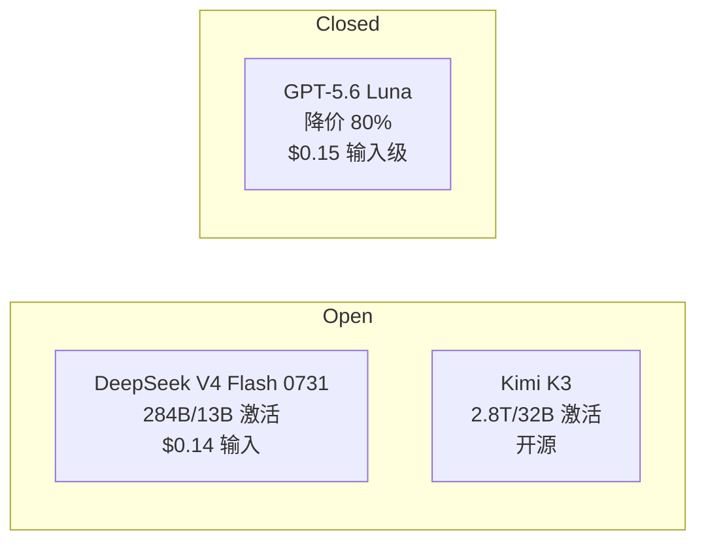

> 本文是模型评测系列的一篇。前作《[GPT-5.6 价格-性能革命](/blog/2026/07/31/gpt-5-6-price-performance-analysis)》拆解了闭源侧的价格战，《[Kimi K3 架构分析](/blog/2026/07/29/kimi-k3-architecture-analysis)》解读了开源侧的 2.8T 巨兽，本篇聚焦 DeepSeek 在 7 月 31 日放出的新变体：**DeepSeek V4 Flash 0731**。

2026 年 7 月 31 日，Artificial Analysis 发布了 DeepSeek V4 Flash 0731 的独立评测（Reasoning / Max Effort 版本），随后在 Hacker News 上引发热议（500+ 分）。在 GPT-5.6 宣布 Luna 降价 80%、Kimi K3 主打自托管性价比的混战周里，DeepSeek 用一个 284B 总参数的 MoE 模型把「智能/价格」的比值又推高了一截。本文基于 Artificial Analysis 的公开评测数据，拆解这份答卷背后的模型参数、定价结构与工程启示。

{/* truncate */}

## 一、核心数据速览

| 指标 | DeepSeek V4 Flash 0731 (max) | 说明 |
|---|---|---|
| 智能指数 (Intelligence Index) | **50** | 同级别中位数 25，排名 **3/101** |
| 总参数 / 激活参数 | **284B / 13B** | MoE 稀疏激活，约 22:1 |
| 上下文窗口 | **1M tokens** | 约 1500 页 A4 文档 |
| 输入价格 | **$0.14 / 1M tokens** | 同级别中位数 $0.43 |
| 输出价格 | **$0.28 / 1M tokens** | 同级别中位数 $1.20 |
| 缓存命中价 | **$0.003 / 1M tokens**（-98%） | 101 个同类模型中排名第 1 |
| 输入/输出模态 | 文本 / 文本 | 纯文本模型 |
| 许可证 | **MIT** | 开源权重，HuggingFace 可下载 |
| 评测总成本 | $72.02 | 跑完整个智能指数的账单 |

几个关键读数：**智能指数 50 分是同类中位数的两倍**，同时输入价格只有中位数的三分之一、输出价格不到四分之一。也就是说，它用约 1/3 的价格拿到了 2 倍的智能——这正是「性价比之王」这个标题的出处。

## 二、智能指数 50 分意味着什么

Artificial Analysis 的 Intelligence Index v4.1 由 9 项评测加权构成：

- **GDPval-AA v2**：真实世界代理工作（Elo 制）
- **τ³-Banking**：代理工具调用
- **Terminal-Bench v2.1**：代理编码与终端操作
- **SciCode**：科学计算编码
- **Humanity's Last Exam**：推理与知识
- **GPQA Diamond**：科学推理
- **CritPt**：物理推理
- **AA-Omniscience**：知识准确性与幻觉率
- **AA-LCR**：长上下文推理

这套评测的重心明显偏向 **agentic 能力**（真实工作、工具调用、终端操作），而非传统的静态知识问答。V4 Flash 0731 得分 50，意味着它在代理类任务上的表现进入第一梯队——这正好呼应了 DeepSeek 这轮更新的定位：**给 Agent 工作负载提供便宜又好用的底座**。

一个值得注意的细节：它在智能指数评测中一共生成了 **2.1 亿个输出 token**，而同类中位数是 1 亿——**输出冗长度是同类的一倍**（排名 36/101）。这是推理模型的典型特征：max effort 模式会用大量内部思考换取更高的准确率，但代价是更高的 token 消耗和更长的端到端延迟。选型时如果你的场景对延迟敏感，需要权衡「更聪明的冗长」和「更快的直接」。

## 三、价格结构：便宜的不是输入，是缓存

| 价格项 | V4 Flash 0731 | 同类中位数 | 倍率 |
|---|---|---|---|
| 输入 | $0.14 / 1M | $0.43 / 1M | 0.33× |
| 输出 | $0.28 / 1M | $1.20 / 1M | 0.23× |
| 缓存命中 | $0.003 / 1M | — | 输入价的 2.1% |

缓存命中价 $0.003/1M tokens 是当前 101 个同类模型中**最低的**（排名 1/101）。这个数字对推理架构师有直接含义：**如果你的工作负载有大量重复前缀（系统提示、few-shot 示例、工具定义、长文档检索结果），DeepSeek 的缓存命中定价会把边际成本压到几乎为零**。

举个量化例子：一个 Agent 应用每次请求携带 50K 的系统提示 + 工具 schema，如果前缀缓存命中率 80%，那么：

- 每 100 万次请求的输入成本 ≈ 50K × (0.2 × $0.14 + 0.8 × $0.003) ≈ **$1.52**（无缓存则为 $7.00）
- 在缓存友好场景下，输入侧成本可以压到原来的 **1/5** 以下

对比同周发布的 GPT-5.6 Luna 主打「推理效率工程」降本，DeepSeek 走的是另一条路：**用开源权重 + 极致低价让用户自己掌握缓存与部署的控制权**。

## 四、架构推断：284B/13B 意味着什么

评测页面给出的参数规模是 284B 总参、13B 激活——这是典型的 MoE 稀疏架构，稀疏激活比约 21.8:1，与 DeepSeek 一贯的 DeepSeekMoE 路线一脉相承。

把三个模型放在一起看很有意思：

- **激活参数规模**：13B 激活低于 Kimi K3 的 32B，但拿到了 50 的智能指数——说明这代模型的「每激活参数效率」显著提升
- **部署友好度**：284B 总参意味着 FP8 权重约 284GB，单机 8×H20（128GB）可以装下；配合 MoE 推理框架（如 vLLM、SGLang 的 expert-parallel）可以做到单机部署
- **1M 上下文**：对齐 GPT-5.6 与 Kimi K3-256K 的长期记忆竞赛，长文档 RAG 场景直接可用

## 五、开源与生态意义

MIT 许可证 + HuggingFace 权重 + 开放评测数据，让 V4 Flash 0731 成为「可私有化部署的前沿智能」——这在闭源模型价格战中是一个稳定锚点：

- **企业合规**：MIT 许可对商用无附加限制，金融、政务等敏感场景可以私有化
- **可观测性**：权重在手，可以本地复现评测、做可解释性分析、微调对齐
- **生态杠杆**：DeepSeek 的开源策略持续压低全球推理价格曲线，与《[DeepSeek 开源的价值](/blog/2026/07/13/deepseek-open-source-value)》中分析的模式一致——用开源换取生态位

## 六、工程启示

1. **缓存友好设计是第一优先级**：把系统提示、工具 schema、检索上下文组织成可复用前缀，最大化命中 DeepSeek 的 $0.003 缓存价
2. **按任务拆分模型档位**：max effort 推理模型适合复杂 agentic 任务，但 2.1 亿 token 的冗长度不适合高吞吐简单问答——混合路由（简单任务走非推理变体）能显著降低成本与延迟
3. **评测成本可复现**：$72.02 跑完整个智能指数的成本透明化，意味着任何团队都可以在自己的关键任务上做 A/B 对比，而不是盲信榜单

## 总结

DeepSeek V4 Flash 0731 的答卷可以概括为：**两倍于中位数的智能指数、三分之一的价格、全网最低的缓存命中价、MIT 开源**。在 GPT-5.6 用「推理效率工程」回应开源围剿的同时，DeepSeek 用「更大稀疏度 + 更极致的定价」守住了开源侧的性价比王座。对工程师来说，最值得行动的其实是那个 $0.003 的缓存价——它把「Agent 应用大规模运行」的边际成本真正压到了可忽略的量级。

**相关阅读：**
- [GPT-5.6 价格-性能革命：Luna 降价 80% 背后的推理效率工程](/blog/2026/07/31/gpt-5-6-price-performance-analysis)
- [Kimi K3 架构分析：2.8T MoE 的技术全景](/blog/2026/07/29/kimi-k3-architecture-analysis)
- [HotPin：无损 MoE 推理的内存优化](/blog/2026/07/29/hotpin-lossless-moe-inference)
- [DeepSeek 开源的价值](/blog/2026/07/13/deepseek-open-source-value)

> 数据来源：[Artificial Analysis — DeepSeek V4 Flash 0731 Intelligence, Performance & Price Analysis](https://artificialanalysis.ai/models/deepseek-v4-flash)（2026-07-31），Intelligence Index v4.1 由 9 项独立评测构成。本文为公开评测数据的解读，不构成部署建议。
