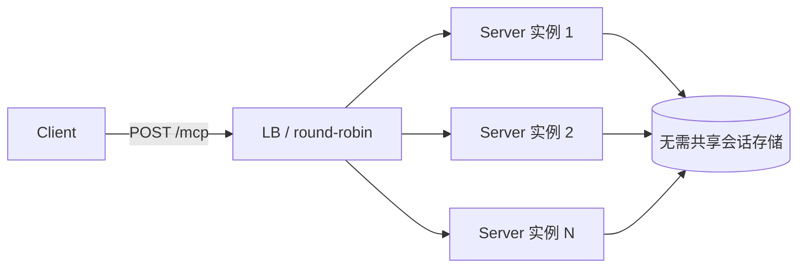

> 本文是 Agent 协议系列的第三篇，前篇《[MCP 协议深度解析](/blog/2026/07/26/mcp-protocol-deep-dive)》介绍了 MCP 的架构设计与传输层实现，本篇聚焦 2026-07-28 发布的新版规范——这是 MCP 诞生以来最重要的一次「破坏性」更新。

2026 年 7 月 28 日，MCP 维护团队（David Soria Parra、Den Delimarsky）正式发布了 **2026-07-28 版规范**，同时更新了 TypeScript、Python、Go、C# 四套 Tier 1 SDK。用团队自己的话说，这是「自远程 MCP 发布一年多以来最重要的一次版本」。

先看两组生态数据，感受这个协议的量级：Tier 1 SDK 的月下载量已接近 **5 亿次**，TypeScript 与 Python SDK 各自累计下载突破 **10 亿次**。当一个协议以这种规模被生产环境依赖时，它的每一次演进都必须为「规模化部署」而设计——这正是本次更新的主线：**MCP 正在从一个双向有状态的流式协议，变成一个请求/响应式的无状态协议**。

{/* truncate */}

## 一、无状态核心：MCP 的「HTTP 时刻」

### 旧模型的痛点

在 2026-07-28 之前，MCP 客户端与服务器之间需要一次 `initialize` / `initialized` 握手，并通过 `Mcp-Session-Id` 头维持会话。这套设计带来的运维噩梦在社区反馈中被反复提及：

- **会话粘滞**：同一个客户端的后续请求必须路由到同一台服务器实例，否则会话状态丢失
- **共享存储**：多实例部署需要 Redis 之类的共享会话存储，把无状态服务硬生生做成有状态
- **负载均衡受限**：无法用最朴素的 round-robin 算法做水平扩展
- **长连接维护成本**：Streamable HTTP 的常开流（用于 server 主动推送）让网关、WAF、超时策略都变得复杂

### 新模型：每个请求都是自描述的

新规范正式退役了 `initialize` / `initialized` 握手与 `Mcp-Session-Id` 头（对应 SEP-2575、SEP-2567）。现在每个请求独立旅行，协议版本、客户端身份、客户端能力全部放进 `_meta` 字段；如果客户端想提前获知服务器能力，可以调用新的 `server/discover` RPC——但**这不是必需的**，任意请求都可以直接落在任意实例上：

```http
POST /mcp HTTP/1.1
MCP-Protocol-Version: 2026-07-28
Mcp-Method: tools/call
Mcp-Name: search

{"jsonrpc":"2.0","id":1,"method":"tools/call",
 "params":{"name":"search","arguments":{"q":"otters"},
 "_meta":{"io.modelcontextprotocol/clientInfo":{"name":"my-app","version":"1.0"}}}}
```

注意这个请求的完整形态：协议版本、方法名、工具名都在 HTTP 头里，JSON-RPC body 里只留业务参数。这意味着网关可以在**不解析 body** 的情况下完成路由、鉴权、限流。

### 状态怎么办？——显式 Handle 模式

「去掉协议级会话」不等于「应用必须无状态」。规范给出的建议非常值得玩味：**如果服务器需要在多次调用之间携带状态，就用工具铸造一个显式的 handle，让模型把它作为参数来回传递**。

维护团队在发布说明里解释了为什么这比「藏在传输层里的会话状态」更好：

> the model can see the handle and thread it between tools

也就是说，状态从「传输层隐式携带」变成了「模型可见的显式数据」。这对 Agent 的可解释性、可审计性、断点续跑都是质的提升——handle 可以被记录、被序列化、被另一个 Agent 接手。

## 二、MRTR：无状态协议下的双向交互

无状态化面临一个难题：以前服务器可以借着常开流**主动**向客户端发起请求——比如 `elicitation/create`（向用户索要确认）、`sampling/createMessage`（让模型生成内容）、`roots/list`（查询客户端上下文根）。这些服务器发起的请求（server-initiated requests）都依赖双向流。

**MRTR（Multi Round-Trip Requests，SEP-2322）** 解决了这个问题。机制很巧妙：

1. 工具调用中途发现需要用户确认或补充参数
2. 服务器返回 `resultType: "input_required"`，并在响应中附上它需要的请求（elicitation/sampling）
3. 客户端处理这些请求（弹确认框、收集参数），然后把答案放进 `inputResponses` 字段**重试原始调用**

```json
// 服务器响应：需要输入
{"jsonrpc":"2.0","id":1,"result":{
  "resultType":"input_required",
  "requests":[
    {"type":"elicitation","id":"e1","prompt":"确认删除订单 #12345？"}
  ]}}
```

```json
// 客户端带答案重试
{"jsonrpc":"2.0","id":1,"method":"tools/call",
 "params":{"name":"delete_order","arguments":{"id":"12345"},
 "inputResponses":[{"id":"e1","answer":{"confirmed":true}}]}}
```

MRTR 让「工具执行中途需要人类审批」这种生产场景（删除数据、创建计费资源、高风险操作）在无状态架构下成为一等公民——Supabase 在发布说明里明确提到，以前因为运行在无状态架构上，难以支持 elicitation，是 MRTR 让它得以实现。

## 三、基于 Header 的路由与可缓存列表

### Mcp-Method / Mcp-Name 头（SEP-2243）

新规范要求 Streamable HTTP 请求**必须**携带 `Mcp-Method` 和 `Mcp-Name` 头。这带来的工程收益是直接的：

- **网关/API 网关**：基于 header 路由到不同的工具集群，无需解析 JSON body
- **WAF**：直接按方法/工具名做访问控制与告警
- **限流器**：对高频工具（如 `tools/call` + `search`）做差异化限流配额
- **可观测性**：日志、指标、trace 直接取 header，成本远低于 body 解析

### 列表结果可缓存（SEP-2549）

`tools/list`、`prompts/list`、`resources/list`、`resources/read` 的响应现在携带 `ttlMs` 和 `cacheScope` 两个字段。工具目录这类「低频变更、高频读取」的数据，终于有了规范的缓存语义：

- `ttlMs`：缓存有效期
- `cacheScope`：缓存作用域（例如按客户端、按租户还是全局）

好处是双重的：客户端可以减少不必要的重新拉取；同时列表采用**确定性排序**，保证上游的 prompt 缓存（如 LLM 推理侧的 prefix caching）在重连后依然稳定命中。

## 四、授权加固：OAuth 血泪教训的补丁合集

发布说明直言：**授权是实现者投入集成时间最多的领域**。本次有三处关键加固：

1. **RFC 9207 `iss` 校验（SEP-2468）**：授权服务器必须在授权码响应中返回 `iss`，客户端在兑换 code 前必须校验——封堵「授权服务器混淆」（authorization-server mix-up）攻击，即恶意服务器诱导客户端把 code 换给错误的 issuer。
2. **`application_type` 修复（SEP-837）**：客户端在动态客户端注册（DCR）时声明 `application_type`，让授权服务器不再拒绝桌面/CLI 应用的 `localhost` 重定向。很多开发者遇到的 CLI OAuth `redirect_uri` 报错，根源就在这里。
3. **凭证绑定 issuer（SEP-2352）**：客户端凭证绑定到签发它的授权服务器，禁止跨服务器复用。

同时，**DCR 被正式弃用**，转向 CIMD（Client ID Metadata Documents）作为客户端元数据标准；DCR 出于兼容继续可用，但会在未来版本移除。

## 五、Tasks 扩展与弃用清单

### Tasks 转正

Tasks 从实验核心移入正式的 `io.modelcontextprotocol/tasks` 扩展，提供：

- `tasks/get`：轮询式（poll-based）获取任务状态——这比回调更适合无状态架构
- `tasks/update`：新 RPC（SEP-2663）
- `subscriptions/listen`：单一订阅流，客户端按通知类型选择订阅，取代旧的 HTTP GET 变更通知端点

AWS 在发布说明中确认，Tasks 是 AWS 贡献的首批官方 MCP 扩展之一，将用于支撑可靠的长时运行 Agent。

### 明确弃用，12 个月过渡期

| 弃用项 | 说明 |
|---|---|
| Roots | SEP-2577，仍可用 ≥12 个月，新实现不应采用 |
| Sampling | SEP-2577，同上 |
| Logging | SEP-2577，同上 |
| HTTP+SSE 传统传输 | 官方弃用，一年 offramp |
| DCR | 转向 CIMD，向后兼容 |

值得肯定的是这套**正式弃用政策**：至少 12 个月的过渡窗口，让团队可以规划升级而不是被动的反应式修复——这是协议走向成熟的重要标志。

## 六、对生产架构的影响

### 部署者的收益

无状态核心对 MCP Server 的运维是结构性利好：



- **水平扩展**：任意请求落到任意实例，round-robin 即可，无需 Redis 共享会话
- **K8s 部署**：HPA 基于 QPS 直接扩容，无会话亲和性（sessionAffinity）约束，滚动发布不再踢掉在线会话
- **Serverless 友好**：Cloudflare Workers、AWS Lambda 这类无状态平台成为 MCP Server 的一等公民——Cloudflare Agents SDK 宣布从第一天起支持新规范

### 迁移成本与建议

SDK 已提供详细迁移说明，主要成本集中在：

1. 依赖 `Mcp-Session-Id` 的既有客户端/网关逻辑需要重写
2. 依赖 server 主动推送（sampling、roots）的实现需要迁移到 MRTR 模式
3. 服务器内部状态需要改为显式 handle 模式

**给工程团队的建议**：新项目直接采用 2026-07-28 规范；存量项目利用 12 个月过渡期逐步迁移，优先迁移会话相关逻辑，其次处理弃用的 Roots/Sampling/Logging 依赖。

## 总结

MCP 2026-07-28 是一次「成人礼」：它把 Agent 工具协议从「需要精心呵护的会话流」变成「和 Web 一样可缓存、可路由、可全局扩展的普通 HTTP 负载」。无状态核心 + MRTR + 头路由 + 缓存语义 + 授权加固，每一环都在回应生产环境里真实踩过的坑。

核心收获：

- 无状态化让 MCP Server 的部署模型与 Web 服务对齐：round-robin、水平扩展、无共享存储
- MRTR 用「重试+补交参数」替代常开流，保住双向交互能力
- 基于 header 的路由让网关层可以零成本解析地治理工具流量
- RFC 9207 校验、CIMD、凭证绑定，补齐了 OAuth 集成中最痛的几个洞
- 正式弃用政策（12 个月窗口）给了生态平稳升级的节奏

**相关阅读：**
- [MCP 协议深度解析：架构设计、传输层与工具编排最佳实践](/blog/2026/07/26/mcp-protocol-deep-dive)
- [利用工具与 MCP 扩展 LLM 能力](/blog/2026/07/23/extending-llm-capabilities)
- [Function Calling 实践指南](/blog/2026/07/23/function-calling-implementation-guide)
