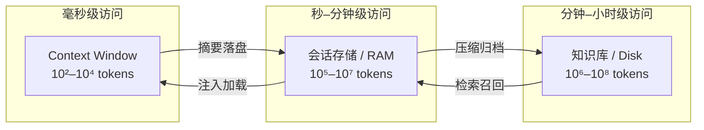

过去两年我们花了很多精力在「输入端」——prompt engineering、few-shot、结构化输出。但 Agent 规模化之后，真正的瓶颈转移到了**上下文（context）本身**：怎么把有限、昂贵、会腐烂的上下文，像内存一样管理起来。Anthropic 在 2025 年 9 月发表的《Effective context engineering for AI agents》把这件事正式命名为 **context engineering**——一门关于「上下文生命周期」的工程学科。

本文不重复「怎么写好 prompt」，而是把上下文当成一种**可度量、可压缩、可缓存、可分层存储的资源**，讨论四个核心问题：它为什么会烂（context rot）、怎么主动丢弃（compaction）、怎么变便宜（caching）、以及怎么用外部存储补足它（memory hierarchy）。

{/* truncate */}

## 一、Context 是 Agent 的工作内存

把 LLM 会话类比成一台计算机：模型权重是「硬盘里的程序」，**context window 是它的 RAM**——程序不能运行在硬盘上，所有参与推理的数据必须加载进内存。这个类比有三层含义：

1. **容量有限**。即使 1M 上下文（如 DeepSeek V4 Flash 的 1M context）也只是把 RAM 变大了，没有改变「全部相关数据必须驻留」的约束。
2. **读写昂贵**。输入 token 按量计费，长上下文还带来 O(n²) 的注意力开销，推理时延随长度非线性上涨。
3. **内容决定质量**。RAM 里装了什么，模型就只能基于什么推理——装错了，模型再强也没用。

所以 Agent 系统里最值得优化的不是单次 prompt，而是**上下文生命周期**：什么内容该进、什么时候该出、以什么形态存在。

## 二、Context Rot：第一个要对抗的敌人

**Context rot（上下文腐烂）**指上下文随时间劣化、导致模型表现下降的现象。它不是玄学——Anthropic 用可控实验量化过：在一个 50 状态的 end-state 测试中，**只加入 1 条不相关状态，模型越界违规率从 0% 升到 8%；加入 5 条时飙到 30%**。无关信息不是「无害的噪音」，它主动伤害模型。

腐烂有四种典型来源：

| 来源 | 典型例子 | 后果 |
|---|---|---|
| 无关信息堆积 | 把整份系统日志丢进 prompt | 注意力被稀释，关键信号被淹没 |
| 矛盾信息并存 | 旧结论 + 新事实同时存在 | 模型摇摆、重复劳动 |
| 格式漂移 | 中途换了 JSON schema | 输出格式错误、解析失败 |
| 示例污染 | 反例混进正例 | 模型学到错误模式 |

对抗 rot 的三个原则（Anthropic 原话）：**relevant（相关）、non-redundant（不冗余）、ordered（有序）**。落到工程上是两个动作：

- **指令上下文与数据上下文分离**（two-context pattern）：系统提示放「如何思考」，数据放「思考什么」。指令被轮次累积的对话污染，是 rot 最常见也最隐蔽的形式。
- **写操作与读操作分流**：Agent 每一步「写」进上下文的内容要经过过滤器——这条日志、这个报错、这个中间结果，真的需要被模型「看见」吗？很多 rot 是**自残**：Agent 自己把工具输出原样追加，几轮之后上下文里全是无效中间产物。

## 三、压缩（Compaction）：主动丢弃的艺术

上下文装不下时，幼稚的做法是「截断」（truncate）——从最老的地方硬切。这几乎总是错的，因为早期轮次往往承载着任务定义和关键决策。正确的做法是**压缩（compaction）**：用更少的 token 保留同样的信息量。

四种压缩手段对比：

| 方法 | 保真度 | 成本 | 适用场景 |
|---|---|---|---|
| 抽取式（保留原文关键片段） | 高 | 低 | 日志、报错、代码 diff |
| 摘要式（LLM 生成总结） | 中，有损 | 中 | 长对话历史、阶段性结论 |
| 结构化（表格/JSON 固化状态） | 中高 | 低 | 任务状态、决策记录、事实清单 |
| 分层压缩（先抽取、再摘要） | 中高 | 中 | 大任务、超长会话 |

一个实用策略是**里程碑压缩**：不在固定轮次压缩，而在「事件点」压缩——任务阶段完成、错误发生、工具调用超时。压缩前先把关键事实固化成结构化状态，再摘要对话，两层都保留：

```python
def compact(session, trigger):
    # 1. 先固化结构化状态（不可丢）
    state = extract_state(session.artifacts)   # -> JSON: goal, decisions, done, blocked
    # 2. 再摘要对话（可丢失的中间过程）
    summary = summarize(session.turns, focus=session.current_goal)
    # 3. 组装新上下文：指令 + 状态 + 摘要
    return build_context(session.system_prompt, state, summary)
```

关键纪律：**压缩后的摘要必须可校验**。保留原始轮次的引用（如 `(turn 12-18 详见 backup)`），当模型行为异常时能回溯原文，否则压缩就是「把 rot 变成失忆」。

## 四、缓存：让 Context 变便宜

上下文反复读取时，**prompt caching** 是性价比最高的优化——把稳定前缀缓存起来，命中部分按远低于输入的价格计费：

| 服务（以 2025 年公开定价为例） | 未命中输入 | 命中输入 | 命中/未命中 |
|---|---|---|---|
| Anthropic（Sonnet 级） | $3.00 / 1M | $0.30 / 1M | ~0.1x |
| OpenAI（GPT-4.1 级） | $2.50 / 1M | $1.25 / 1M | ~0.5x |
| DeepSeek（V3 级） | $0.27 / 1M | $0.014 / 1M | ~0.05x |

缓存的工程约束只有一个：**命中要求前缀逐字节一致**。这意味着：

1. **稳定前缀优先**：系统提示、工具定义、few-shot 示例放最前面，且尽量不修改。改一个字，整条缓存失效。
2. **易变数据放最后**：当前时间、用户消息、检索结果追加在尾部，不破坏前缀。
3. **缓存意识的结构化**：把「每条消息都可能变」的字段（如 `user_id` 内联）挪出前缀区，改用缓存外查表。

对 Agent 而言，把「系统提示 + 工具 schema + 历史摘要」固定成前缀，一次会话的缓存命中率可以做到 80% 以上——成本直接降一个数量级，这是把上下文从「消费」变成「投资」的关键一步。

## 五、分层记忆：窗口不是唯一的内存

把 context window 当唯一内存是 Agent 架构最常见的错误。正确模型是**分层记忆**，每一层有不同的容量、访问成本与保留时间：



对应到实现：

- **热层 = context window**：只放当前任务必需的「相关、不冗余、有序」内容。
- **温层 = 会话存储/向量库/JSON store**：放结构化状态与可检索的中间产物。Claude 的 memory tool 就是自动把旧对话摘要写入温层，需要时再加载。
- **冷层 = 知识库/文档**：RAG 的源头。冷层进热层必须经过「检索 + 重排 + 过滤」，而不是全量灌入。

## 六、检索即上下文工程

RAG 的本质不是「把知识库接进 LLM」，而是**决定哪些 token 值得占用 context window**。Liu 等人 2023 年的经典论文《Lost in the Middle》（arXiv:2307.03172）证明：长上下文下，模型对**开头和结尾**的内容利用率最高，中间位置的利用率显著下降。这对检索排序有直接含义：

1. **关键证据放首尾**：把最相关的检索结果放最前，次相关的放最后，不要按「原始相关性分」均匀排列——那是给搜索引擎排的序，不是给 LLM 排的序。
2. **去冗余**：检索出的 Top-K 片段常互相重复，先做 MMR（最大边际相关）或语义去重，把「信息增量」而非「文档数」喂进上下文。
3. **按需检索代替全量注入**：上下文窗口越大越要克制——1M 上下文不等于「把 1M 塞进去」，而是「允许你在需要时加载其中一小部分」。

## 七、可度量的上下文质量

Context engineering 的前提是**可度量**。三类基础手段：

- **End-state test**：给 Agent 一个明确终点状态（如「把集群所有节点打上 label」），跑 N 次统计失败率——Anthropic 的 rot 实验用的就是这种。
- **Needle-in-a-haystack 变体**：把关键约束埋在长上下文中，测模型能否在轮次中持续遵守（比单次检索更接近 Agent 现实）。
- **LLM-as-judge 对比**：对同一任务，用「压缩后上下文」与「全量上下文」各跑一遍，用裁判模型对比输出质量——压缩是否真的无损，用它来验收。

建议把「上下文质量」纳入 Agent 的可观测性指标（配合之前写的《[AI Agent 工程化实践](/blog/2026/07/30/agent-engineering-production-guide)》里的 tracing）：记录每轮的 context 大小、压缩触发、缓存命中率、关键事实是否在上下文尾部丢失。

## 小结

上下文工程的核心是一句话：**Context 不是输入，而是状态**。它需要像管理内存一样管理——知道什么在热层、什么时候该淘汰、怎么压缩不丢关键信息、怎么让读取变便宜。当你的 Agent 从「demo 能跑」走向「生产稳定」，遇到的第一个硬瓶颈几乎总是上下文：不是模型不够聪明，而是喂给它的「工作内存」被浪费、被污染、被撑爆了。

## 相关阅读

- [RAG with LangChain + Qdrant 实战](/blog/2026/07/03/rag-with-langchain-qdrant) — 检索侧的具体实现
- [MCP 协议深度解析](/blog/2026/07/26/mcp-protocol-deep-dive) — 工具调用间的上下文传递协议
- [AI Agent 工程化实践](/blog/2026/07/30/agent-engineering-production-guide) — 可观测性、安全、错误恢复
- [DeepSeek V4 Flash 解析：1M 上下文的性价比之王](/blog/2026/08/01/deepseek-v4-flash-analysis) — 长上下文模型的能力边界
