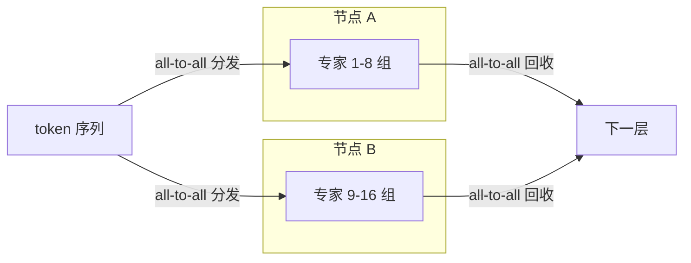
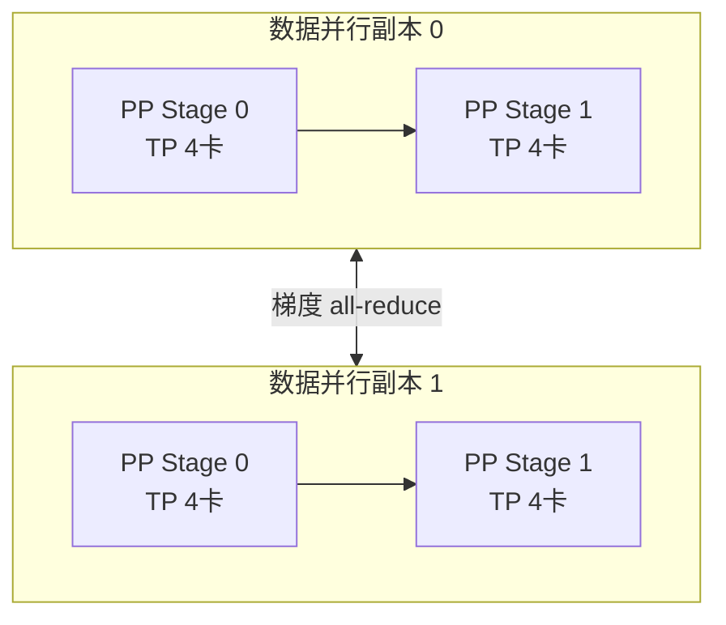

单机训练大模型失败，从来不是因为「模型参数装不下」这一句话。真正的问题是：训练一个模型需要保存四份不同的状态——**参数、梯度、优化器状态、前向激活值**——而它们各自都以不同方式随模型规模增长。以 175B 参数的 GPT-3 为例（ZeRO 论文给出的估算）：仅 Adam 优化器状态就约 **1.2TB**，梯度约 0.7TB，参数约 0.7TB，合计 **约 2.6TB**，而 2020 年最强的 A100 80GB 也只有 80GB 显存。这就是为什么 GPT-3 要在约 10,000 张 V100 的集群上训练。

但这只是「装不下」的问题。分布式训练真正的难点在于：**把状态切开之后，如何在切面之间保持数学等价**。本文拆解五种并行方式——DP、TP、PP、SP、EP——各自的切分维度、通信模式与组合方式，并给出工程上的选择依据。所有数字均来自可查证的论文与硬件规格。

{/* truncate */}

## 一、先算账：训练状态的四本账

训练过程需要在显存里维护四类数据，它们的规模各不相同：

| 状态 | 每个参数的字节数（Adam + 混合精度） | 175B 模型总量 |
|---|---|---|
| fp16 参数 | 2B | ~350GB |
| fp16 梯度 | 2B | ~350GB |
| 优化器状态（fp32 m、v、主权重） | ~12B | ~1.2TB+ |
| 激活值（Activation） | 随序列长度与层数线性增长 | 无法预先固定 |

前三种是「模型状态」，第四种激活值才是训练时显存的真正大头——一个 7B 模型、8K 序列、不做 checkpointing 时，激活值可以轻松超过参数本身。**模型状态决定你需要多少张卡，激活值决定你在每张卡上怎么做切分**。这两条线分别导向了不同的并行策略。

## 二、五种并行：切什么，通什么

| 并行方式 | 切分维度 | 每步通信 | 通信模式 | 典型场景 |
|---|---|---|---|---|
| DP（数据并行） | 按 batch 复制模型 | 每步一次梯度 all-reduce，量 = 模型大小 | all-reduce | 模型能装进单卡 |
| ZeRO / FSDP | 按状态分区（DP 的升级） | 参数 all-gather + 梯度 reduce-scatter | all-gather / reduce-scatter | 单卡装不下完整模型 |
| TP（张量并行） | 按层内矩阵维度切 | 每层多次 all-reduce，量 ≈ 激活值 × 层数 | all-reduce | 单卡算不动单层 |
| PP（流水线并行） | 按层切分 | 每 micro-batch 传一次 activation | point-to-point | 跨节点、降低显存 |
| SP（序列并行） | 按序列长度切 LayerNorm/Dropout | 每层 2 次 all-gather + reduce-scatter | all-gather / reduce-scatter | 长序列训练 |
| EP（专家并行） | MoE 按专家切分 | 每层一次 all-to-all（token 分发 + 回收） | all-to-all | MoE 模型 |

两个容易混淆的点：**DP 复制的是模型，TP/PP/EP 复制的是数据**；DP 的通信量与模型大小成正比（所以模型越大 DP 越贵），TP 的通信量与激活值成正比（所以序列越长 TP 越贵）。这就是为什么超大模型要把 DP 和 TP 一起用——它们吃的是不同的资源。

## 三、从 DDP 到 ZeRO/FSDP：状态分区是怎么省显存的

DDP（Distributed Data Parallel）在每张卡上复制一份完整模型，每步对梯度做 all-reduce，通信量 = 模型大小 × 2。它解决的只是「算得快」，不是「装得下」。

ZeRO（论文：ZeRO: Memory Optimizations Toward Training Trillion Parameter Models）的核心洞察是：**显存浪费在冗余，而不是缺少**。它把模型状态按 DP 组大小分区，分三个阶段递进：

- **ZeRO-1**：只分区优化器状态。175B 模型把 1.2TB 优化器状态均分到 64 卡，每卡只留 ~19GB，其余按需取回；
- **ZeRO-2**：再加上梯度分区；
- **ZeRO-3**：参数也分区，配合 all-gather 按层取回，单卡可以训练装不下的模型。

FSDP（PyTorch 官方实现）把 ZeRO-3 的语义暴露为易用的 API：每个 transformer 层前 all-gather 参数，层后 reduce-scatter 梯度并释放。二者的通信量都是模型大小的 2 倍左右（与 DP 相当），但显存占用随卡数线性下降——**用通信换显存**是状态分区的基本功：

```python
# FSDP 核心用法：按层切分，通信与计算重叠
from torch.distributed.fsdp import FullyShardedDataParallel as FSDP

model = FSDP(
    model,
    auto_wrap_policy={TransformerBlock},   # 以 block 为粒度切分
    sharding_strategy="FULL_SHARD",        # 参数/梯度/优化器状态全分区
    use_orig_params=True,
    forward_prefetch=True,                 # 预取下一层参数，隐藏通信
)
```

## 四、TP 与 PP：单层放不下、层数放不下

当单层矩阵（如 7B 模型的 attention + MLP 权重）超过单卡显存，DP/ZeRO 都救不了，必须**把一层切开**——这就是张量并行（TP）。Megatron-LM 的做法是把列并行线性层 + 行并行线性层交错排列，让 all-reduce 在矩阵乘法内部与计算重叠。TP 的代价是通信频率极高（每个 transformer 层多次 all-reduce），所以 TP 组必须限制在节点内，吃 NVLink 带宽（H100 约 900GB/s），跨节点跑 TP 是灾难。

流水线并行（PP）则按层切分：第 0-7 层在卡 A，8-15 层在卡 B。它的通信量小（每个 micro-batch 只传一次激活，点对点），但引入**流水线气泡**——切分越多、micro-batch 越少，气泡越大。GPipe 的气泡比约 (p-1)/(m+p-1)，1F1B 调度（Megatron 的 interleaved schedule）能把气泡压到接近理论下限。PP 是四种并行里唯一「每张卡之间算的是不同代码」的，也因此它的可调试性最差。

## 五、MoE 时代：专家并行 EP 与 all-to-all

DeepSeek-V2 带来两个工程变量：MLA（多头潜在注意力，把 KV cache 压到约 1/8）和 DeepSeekMoE（236B 总参数、每 token 只激活 21B）。MoE 的每个 token 只需要部分专家，于是出现第四种切法——**按专家切分（EP）**：每个 token 在每层通过 **all-to-all** 被分发到对应专家所在卡，算完再 all-to-all 收回来。

all-to-all 与 all-reduce 的本质区别：all-reduce 每个人拿到相同结果，all-to-all 每个人拿到不同结果。MoE 的负载天然不均衡（热门专家接更多 token），所以 EP 的工程核心是**分组**：DeepSeek-V2 把 8 个专家一组放到同一节点，组内通信走 NVLink，组间走 RDMA，把 all-to-all 的跨节点流量降到最低。



## 六、组合成 3D 并行：一份可照抄的拓扑

实际训练 100B+ 模型几乎不用单一并行，而是三层组合（Megatron-Turing 530B 就是在 4,480 张 A100 上用这种组合训练出来的）：

1. **TP 组**：2-8 卡，节点内，NVLink，负责「一层放不下」；
2. **PP 组**：多个 TP 组串成流水线，负责「层数放不下」；
3. **DP/FSDP 组**：多组流水线副本，负责「吃满算力 + 分优化器状态」。



在这个 16 卡拓扑里，通信是分层的：TP 内 all-reduce 走 NVLink（~900GB/s），PP 间点对点走节点间网络，DP 间梯度 all-reduce 走 RDMA（400Gbps 即 ~50GB/s）。**工程上最大的坑是把不同优先级的通信混在一个通道里**——DP 的梯度 all-reduce 与 TP 的激活 all-reduce 同时进行时，必须靠通信分组（communication groups）和带宽调度（如 NCCL 的 `NCCL_IB_TIMEOUT`、`NCCL_P2P_LEVEL` 调参）把它们隔开。

## 七、工程实践清单

- **先做 activation checkpointing，再谈买卡**：重算前向换显存，通常省 60-70% 激活值，代价约 30% 计算开销，是所有并行方案之上的第一杠杆；
- **TP 不超过节点规模**：TP 组跨节点时通信开销指数增长，宁可加 PP 深度；
- **通信与计算重叠**：FSDP 的 `forward_prefetch`、DeepSpeed 的 gradient accumulation + overlap、Megatron 的 async all-reduce，收益可达 10-20% 端到端吞吐；
- **保存 checkpoint 要异步**：同步保存会把训练停几十分钟，异步保存（先拷贝到 CPU/内存再落盘）是标配；
- **选型速查**：单卡放得下 → DDP/FSDP；单层放不下 → TP；总参数放不下 → FSDP/ZeRO-3 或 PP；MoE → EP + FSDP。

分布式训练的正确姿势是**先算账再选型**：算清四本账分别多大、卡间带宽多少、通信能否被计算掩盖，然后按「先 checkpointing → 再 FSDP → TP 补单层 → PP 补深度 → EP 补 MoE」的顺序逐层叠加。大多数团队的问题不是并行不够花哨，而是**在 TP 还没必要的时候上了 TP**——多出来的通信开销远大于省下的那点显存。

**相关阅读**
- [vLLM 架构深度解析：从 PagedAttention 到生产级推理引擎](/blog/2026/07/26/vllm-architecture-deep-dive)
- [LLM 量化技术实战指南：从 FP8 到 INT4 的生产级优化](/blog/2026/07/30/llm-quantization-production-guide)
- [GB200 NVL72 成本拆解：NVIDIA 机架级方案的算力账本](/blog/2026/07/14/gb200-nvl72-cost-breakdown)
- [LLM 推理的存储 I/O 优化：从 KV Cache 到数据管线的带宽博弈](/blog/2026/07/27/llm-inference-storage-io-optimization)

**参考来源**
- ZeRO: [Memory Optimizations Toward Training Trillion Parameter Models](https://arxiv.org/abs/1910.02054)
- Megatron-LM: [Efficient Large-Scale Language Model Training on GPU Clusters](https://arxiv.org/abs/2104.04473)
- Megatron-LM (Sequence Parallelism): [Reducing Activation Recomputation in Large Transformer Models](https://arxiv.org/abs/2205.05198)
- GPT-3: [Language Models are Few-Shot Learners](https://arxiv.org/abs/2005.14165)
- DeepSeek-V2: [A Strong, Economical, and Efficient Mixture-of-Experts Language Model](https://arxiv.org/abs/2405.04434)
- PyTorch FSDP: [Fully Sharded Data Parallel documentation](https://pytorch.org/docs/stable/fsdp.html)
- NVIDIA: [Megatron-Turing NLG 530B 训练细节](https://www.microsoft.com/en-us/research/blog/using-deepspeed-and-megatron-to-train-megatron-turing-nlg-530b-the-worlds-largest-and-most-powerful-generative-language-model/)
