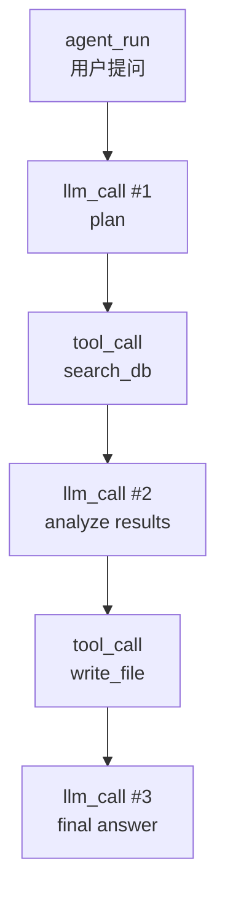

传统可观测性三板斧——指标、日志、链路——搬进 LLM 应用后很快就失灵了。原因有三个：**成本**不再是「一台机器多少钱」而是「一个请求烧了多少 token」；**故障**不再只有 500 错误，还有「返回了 JSON 但字段是错的」「在工具调用里循环了 15 轮」「幻觉编了个不存在的订单号」；**确定性**不复存在——同一 prompt 两次调用结果不同，你没法靠「重放请求」复现 bug。

这不是换一套 dashboard 的事，而是需要一套面向 LLM 的语义模型：知道哪一次调用花了多少钱、哪个 span 对应哪次工具执行、哪条 Agent 轨迹陷入了循环。本文从 OpenTelemetry GenAI 语义约定出发，拆解指标、追踪、成本归因三个层面，最后给出一条可落地的开源工具链路径。

{/* truncate */}

## 一、语义层：OTel GenAI Conventions

OpenTelemetry 的 GenAI 语义约定（semantic conventions）给出了 LLM 观测的标准字段，核心思路是**把一次模型调用建模成一个 span**，属性按「请求」与「用量」分组：

| 属性组 | 关键字段 | 示例 |
|---|---|---|
| 系统标识 | `gen_ai.system` | `openai` / `anthropic` / `vllm` |
| 操作类型 | `gen_ai.operation.name` | `chat` / `generate` / `embeddings` |
| 请求参数 | `gen_ai.request.model`、`temperature`、`max_tokens` | `gpt-4o`、`0.7`、`4096` |
| 响应元数据 | `gen_ai.response.model`、`finish_reasons` | `gpt-4o`、`["stop"]` |
| Token 用量 | `gen_ai.usage.input_tokens`、`output_tokens` | `1842`、`356` |
| 服务端点 | `server.address`、`server.port` | `api.openai.com`、`443` |

一个最小可用的埋点示例（Python + OTel SDK）：

```python
from opentelemetry import trace

tracer = trace.get_tracer("llm-app")

with tracer.start_as_current_span("chat gpt-4o") as span:
    span.set_attribute("gen_ai.system", "openai")
    span.set_attribute("gen_ai.operation.name", "chat")
    span.set_attribute("gen_ai.request.model", "gpt-4o")
    span.set_attribute("gen_ai.request.temperature", 0.7)

    resp = client.chat.completions.create(model="gpt-4o", messages=msgs, temperature=0.7)

    span.set_attribute("gen_ai.response.finish_reasons", [r.finish_reason for r in resp.choices])
    span.set_attribute("gen_ai.usage.input_tokens", resp.usage.prompt_tokens)
    span.set_attribute("gen_ai.usage.output_tokens", resp.usage.completion_tokens)
```

约定统一的价值在于**生态互通**：不管底层是 OpenAI、Anthropic 还是自建 vLLM，语义一致的 span 可以被同一套 dashboards、告警和成本报表消费。自建推理引擎（vLLM/SGLang）则直接暴露 Prometheus 指标，字段名基本对齐。

## 二、指标层：延迟拆解与缓存命中率

LLM 服务的延迟必须拆到 token 粒度才可诊断。自回归生成有天然的三段式：prefill（处理输入）→ inter-token（逐 token 生成）→ 完成。对应指标：

| 指标 | 全称 | 含义 | 关注点 |
|---|---|---|---|
| TTFT | Time to First Token | 请求发出到首个 token 返回 | 用户感知的「响应速度」，受 prefill 与排队影响 |
| TPOT | Time Per Output Token | 每个输出 token 的平均生成时间 | 受显存带宽、KV Cache、batch 大小影响 |
| ITL | Inter-Token Latency | 相邻 token 间隔 | 流式体验的平滑度 |
| 缓存命中率 | Prefix Cache Hit Rate | 前缀缓存命中的请求占比 | vLLM 开启前缀缓存后的关键效率指标 |

三个高频告警模式：

1. **TTFT 突增而 TPOT 正常** → prefill 排队或长前缀未命中缓存，检查并发数与前缀缓存命中率；
2. **TPOT 随并发线性恶化** → batch 过大或 KV Cache 换出，检查 `max_num_seqs` 与显存占用；
3. **缓存命中率长期低于 30%** → system prompt 每次都在变（时间戳、随机 ID 混入前缀），前缀缓存形同虚设——这是最常见的「优化失效」根因。

## 三、成本层：Token 计量与归因

LLM 的成本粒度是「模型 × token 类型（输入/输出/缓存命中）× 数量」，归因必须落到这三级。埋点时已拿到 `gen_ai.usage.*`，成本报表只需乘上定价表：

```python
PRICING = {
    "gpt-4o": {"input": 2.50, "output": 10.00},        # $/1M tokens
    "claude-3-5-sonnet": {"input": 3.00, "output": 15.00},
}

def cost_of(span_attrs: dict) -> float:
    model = span_attrs["gen_ai.response.model"]
    price = PRICING[model]
    in_tok = span_attrs.get("gen_ai.usage.input_tokens", 0) / 1e6
    out_tok = span_attrs.get("gen_ai.usage.output_tokens", 0) / 1e6
    return in_tok * price["input"] + out_tok * price["output"]
```

工程要点：**用量必须来自响应体里的 usage 字段，不要自己数 token**——不同模型的 tokenizer 不同，自行估算的误差在长上下文场景可以到 30%+。归因维度建议按 用户 / 功能模块（span 名前缀）/ 模型版本 三个维度打平，月底的成本异常就能直接定位到「哪个功能换了贵模型」或「哪个用户被无限重试打爆」。

## 四、Agent 轨迹追踪：循环、失败与质量

Agent 应用的可观测性核心是一个**嵌套 span 树**：一次 agent run 是根 span，其下是多次 LLM 调用、工具执行、检索查询的子 span，父子关系天然反映调用链。



三个 Agent 特有的可观测性信号：

1. **循环检测**：对 (tool_name, args_hash) 做窗口去重，同一工具+相同参数在窗口内出现 ≥3 次即为循环。循环是 Agent 生产事故的头号形态，比「报错」更隐蔽——系统在正常地烧钱空转；
2. **重试风暴**：LLM 调用失败后的指数退避重试会放大成本与延迟，追踪里要能一眼看出「同一个 span 重试了几次」；
3. **检索质量代理指标**：RAG 场景记录检索结果的 top-k 分数分布与引用命中率，比等到用户投诉「回答错了」更早发现问题。

**采样与隐私策略**：LLM 日志天然包含用户数据，默认策略应该是——100% 采集结构化元数据（模型、用量、延迟、错误码），**prompt/response 全文默认不采集**，仅对按 1~5% 抽样的 trace 落盘全文，且对已知 PII 字段做脱敏。既保成本可控，又避数据合规风险。

## 五、开源工具链落地路径

- **Arize Phoenix**：自托管、OTel 原生，支持 prompt 与 span 级评估（eval），适合作为 Agent 轨迹与检索质量的观察台；
- **Langfuse**：自托管，跟踪/成本/评分一体，和 LangChain 生态集成最深；
- **OpenLLMetry（Traceloop）**：用 OpenTelemetry instrumentation 自动给主流 LLM SDK 埋点，改动最小；
- **vLLM 内置 `/metrics`**：自建推理时直接采集 TTFT、TPOT、缓存命中率、GPU 利用率到 Prometheus。

落地的顺序建议：**先统一埋点（OTel 约定）→ 再建成本报表（用量×定价）→ 再上延迟指标告警 → 最后做 Agent 轨迹与循环检测**。前两步一周内就能见效——绝大多数团队第一次看到「每个功能模块各烧了多少钱」时，都会立刻发现至少一个可以砍掉的浪费。

## 结论

LLM 可观测性不是「把日志收集起来」，而是**建立一套以 token 为中心、以调用图为结构的语义模型**：OTel GenAI 约定统一数据格式，TTFT/TPOT/缓存命中率定义性能基线，用量×定价实现成本归因，嵌套 span 树暴露 Agent 的循环与失败。它解决的是传统监控答不出的三个问题：钱花哪了、慢在哪一步、Agent 为什么空转。

**相关阅读**
- [Agent 工程化落地指南：从原型到生产](/blog/2026/07/30/agent-engineering-production-guide)
- [LLM 评测的工程化：从基准分数到 LLM-as-a-Judge 的生产实践](/blog/2026/08/04/llm-eval-llm-as-judge)
- [LLM 路由的工程实践与教训：从成本控制到多模型编排](/blog/2026/08/03/llm-router-engineering-lessons)
- [上下文工程深度解析：从长上下文窗口到精准信息注入](/blog/2026/08/02/context-engineering-deep-dive)

**参考来源**
- OpenTelemetry: [GenAI Semantic Conventions 规范](https://opentelemetry.io/docs/specs/semconv/gen-ai/)
- vLLM: [Metrics 与 Prometheus 集成文档](https://docs.vllm.ai/en/latest/observability/metrics.html)
- Arize AI: [Phoenix — 开源 LLM 可观测性与评估](https://github.com/Arize-ai/phoenix)
- Langfuse: [开源 LLM 工程平台](https://github.com/langfuse/langfuse)
- Traceloop: [OpenLLMetry — OpenTelemetry 自动埋点](https://github.com/traceloop/openllmetry)
