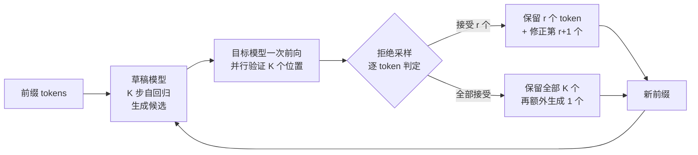

自回归解码的本质是「一步一个 token」：生成第 t 个 token 必须等前 t-1 个 token 全部算完，而且每个 token 都要跑一遍完整的前向传播。在 decode 阶段，Transformer 的算力利用率通常只有个位数百分比——因为激活很小、瓶颈在显存带宽（memory-bound），GPU 上几 TB/s 的 HBM 带宽被浪费在搬运权重上。这就是投机解码（Speculative Decoding）要解决的核心矛盾：**能不能用便宜的计算提前猜出未来几个 token，让大模型一次前向同时验证 K 个猜测？**

答案是能，而且无损失。本文拆解投机解码的数学原理、三条主流实现路线（独立草稿模型 / Medusa 多解码头 / EAGLE 特征级草稿）、以及 vLLM 中的生产配置与收益边界。

{/* truncate */}

## 一、核心思想：小模型草稿，大模型并行验证

投机解码（Leviathan et al. 2022 / Chen et al. 2023，两篇论文几乎同时独立提出）的思路分四步：

1. **草稿**：一个轻量草稿模型（draft model）以自回归方式快速生成 K 个候选 token；
2. **验证**：目标模型把「前缀 + K 个候选」打包成一次前向，**并行**算出每个位置的真实概率分布；
3. **接受**：从前往后逐个 token 用拒绝采样（rejection sampling）判定接受/拒绝，接受则保留；
4. **修正**：在第一个被拒绝的位置，从目标模型的分布中重新采样一个 token 作为修正，然后以该位置为起点进入下一轮。



关键在**第 3 步的数学保证**：设草稿分布为 q、目标分布为 p，对每个位置以概率 `min(1, p(x)/q(x))` 接受草稿 token，被拒绝则从 `max(0, p(x) - q(x))` 归一化后的分布重新采样。标准拒绝采样理论保证：**最终输出分布与目标模型直接解码的分布完全一致**——这是投机解码与「提前退出」「截断生成」等启发式加速的本质区别：它是 lossless 的，模型质量零损失。

## 二、收益数学：接受率决定一切

记 β 为单 token 的拒绝率（β = 1 - 接受率），K 为每轮草稿长度，则每轮期望接受的 token 数为：

```
E[N] = (1 - β^(K+1)) / (1 - β)
```

设草稿模型生成 K 个 token 的时间与目标模型一次前向的时间之比为 c，则理想加速比：

```
Speedup ≈ E[N] / (c + 1)
```

| 草稿质量（接受率） | K=4 | K=8 | K=16 | 备注 |
|---|---|---|---|---|
| 强草稿，0.8 | 3.0 | 4.5 | 5.2 | 同族小模型（如 70B 配 8B） |
| 中等草稿，0.7 | 2.4 | 3.2 | 3.5 | 通用小模型 |
| 弱草稿，0.5 | 1.5 | 1.7 | 1.8 | n-gram 统计草稿 |

三个工程推论：

1. **接受率 > 0.6 才有意义**：弱草稿的收益天花板很低，因为 c 也要算进去——草稿模型本身要跑 K 步，不便宜；
2. **K 存在最优值**：E[N] 随 K 收敛，而 c 随 K 线性增长，盲目加大 K 反而拖慢。实践中 K = 4~6 最常见；
3. **草稿必须与目标共享词表**：这是最容易被忽略的硬约束。词汇表不一致意味着 q 和 p 无法对齐，投机解码直接失效——这也解释了为什么同族模型（同 tokenizer 家族）做草稿效果最好。

## 三、三条实现路线：从独立草稿到自我草稿

**路线一：独立草稿模型（Independent Draft）。** 经典方案，用一个参数量小 10~50 倍的同族模型（如 Llama-3-8B 给 70B 当草稿）跑自回归草稿。优点是实现简单、vLLM/SGLang 开箱即用；缺点是**显存要多装一个模型**，且两模型的分布差异决定了接受率上限。

**路线二：Medusa 多解码头（Cai et al. 2024）。** 抛弃独立草稿模型，直接在目标模型的最后一层之上**并联多个轻量解码头**，每个头预测「未来第 i 个位置的 token」；验证时用 tree attention 一次性并行验证整棵候选树。Medusa 论文在 Vicuna-7B/13B 上取得 2.3~3.6× 加速（单请求场景），且不需要额外显存加载草稿模型。

**路线三：EAGLE 特征级草稿（Li et al. 2024）。** 核心观察：词级别的自回归草稿忽略了一个事实——**草稿模型的倒数第二层特征比 token 本身携带更多信息**。EAGLE 在特征空间（second-to-last layer embedding）上做自回归，再用一个轻量映射层把特征转成词分布。论文报告比 Medusa 再快 1.3~2×，在 Vicuna-33B 上达到约 3.5× 的 lossless 加速，是目前自草稿路线的 SOTA 之一。

| 路线 | 草稿来源 | 额外显存 | 典型加速（batch=1） | 复杂度 |
|---|---|---|---|---|
| 独立草稿 | 外部小模型 | 高（+1 个模型） | 2~2.5× | 低 |
| Medusa | 模型自身多头 | 低（数个解码头） | 2.3~3.6× | 中 |
| EAGLE | 模型自身特征层 | 低 | 2.7~3.5× | 高 |
| n-gram 草稿 | 无模型，前缀统计 | 无 | 1.3~1.8× | 极低 |

## 四、生产配置与收益的真实边界

vLLM 内置投机解码支持，启用独立草稿模型的配置很直接：

```bash
vllm serve meta-llama/Llama-3-70B-Instruct \
  --draft-model meta-llama/Llama-3-8B-Instruct \
  --num-speculative-tokens 5 \
  --max-model-len 8192
```

但生产收益有三个容易被忽视的边界：

**1. 并发越高，收益越小。** 投机解码省的是「串行解码步数」；而 continuous batching 下 GPU 本来就满载，每步都在并行服务大量请求，草稿验证的边际收益被摊薄。vLLM 官方文档明确：投机解码在**低并发、长输出、单路延迟敏感**的场景收益最大；高并发吞吐场景可能只剩 1.1~1.3×。

**2. 显存账要算清。** 70B 目标 + 8B 草稿，权重多占约 16GB（fp16），KV Cache 预算被挤压；显存本已紧张的机型反而可能因 KV 空间变小而降低 batch size，抵消收益。小显存场景优先考虑 Medusa/EAGLE 这类自草稿方案。

**3. 质量保证是「分布等价」而非「逐 token 相同」。** 投机解码保证采样分布与目标模型一致，但采样本身有随机性——**这不等于两次运行输出逐字相同**。做回归评测对比时，应比较「分布级指标」（如 benchmark 分数、胜率），而不是 diff 具体输出文本，否则会把正常的随机性当成退化。

## 结论

投机解码是把「串行瓶颈」换成「并行验证」的推理加速范式：草稿模型负责猜测、目标模型负责确认，拒绝采样保证零质量损失。工程选型上：显存充裕选独立草稿（简单可控），显存紧张选 Medusa/EAGLE（自草稿），接受率低于 0.6 或高并发吞吐场景则不值得上。它的收益边界清晰——**低并发长输出的延迟敏感业务，是投机解码的主战场**。

**相关阅读**
- [KV Cache 优化实战：长上下文推理的内存、量化与驱逐](/blog/2026/08/05/kv-cache-optimization-guide)
- [vLLM 架构详解：PagedAttention、Continuous Batching 与生产级推理优化](/blog/2026/07/26/vllm-architecture-deep-dive)
- [LLM 量化技术实战指南：从 FP8 到 INT4 的生产级优化](/blog/2026/07/30/llm-quantization-production-guide)
- [LLM 推理中的存储 I/O 优化：从 HDD 到 CXL 的演进](/blog/2026/07/27/llm-inference-storage-io-optimization)

**参考来源**
- Leviathan et al.: [Fast Inference from Transformers via Speculative Decoding](https://arxiv.org/abs/2211.17192)
- Chen et al.: [Accelerating Large Language Model Decoding with Speculative Sampling](https://arxiv.org/abs/2302.01318)
- Cai et al.: [Medusa: Simple LLM Inference Acceleration Framework with Multiple Decoding Heads](https://arxiv.org/abs/2401.10774)
- Li et al.: [EAGLE: Speculative Sampling Requires Rethinking Feature Uncertainty](https://arxiv.org/abs/2401.15077)
- Miao et al.: [SpecInfer: Accelerating Generative Large Language Model Serving with Tree-based Speculative Inference and Verification](https://arxiv.org/abs/2305.09781)
- vLLM: [Speculative Decoding 官方文档](https://docs.vllm.ai/en/latest/features/spec_decode.html)
