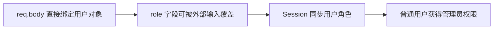

2026 年 8 月，智谱发布 GLM-5.3，官方把这次更新的关键词定成两个：**Coding** 和 **安全**。前者不意外——上一代 GLM-5 的编程能力已经逼近闭源第一梯队；真正值得注意的是后者：模型发布前两周，智谱联合清华、南开及多家企业做了密集红队测试，累计发现漏洞 2404 个（初筛去重后），其中 1088 个中高危，覆盖系统内核、浏览器引擎、开源基础组件、互联网应用与协议等 220 个项目。在 CyberGym 白盒代码审查评测上，GLM-5.3 拿到 84.5%（上一代 5.2 为 77.2%），成为开源阵营里分数最高的安全模型。

为什么一个 Coding 模型要死磕安全？答案很直接：**Coding Agent 已经从"给一段代码"进化到"读整个仓库、改文件、跑终端、装依赖、参与部署"，拿到的权限越来越高，一次判断失误的后果被成倍放大。** 当 AI 以机器速度写代码、操作系统时，安全必须跟上机器速度。这篇文章以 GLM-5.3 的实测为样本，拆解 Coding Agent 安全能力的三层结构：白盒审计、漏洞推理、证据分级——并讨论这套能力该怎么评测、怎么用。

{/* truncate */}

## 一、第一层：白盒代码审查——"看到漏洞"为什么难

传统"模型安全"评测是问模型一个危险问题，看它会不会拒答。白盒代码审查是完全不同的任务：把**完整代码库**扔给模型，让它从输入开始，一路追踪到权限校验、数据流、最终的危险操作。

GLM-5.3 在 CyberGym 上 84.5% 的成绩说明的不是"会识别危险函数"，而是"能在整个代码库的上下文里把漏洞找全"。社区实测里有一个细节很有代表性：一个埋了 12 类漏洞的真实 Node.js 应用（AegisDesk），模型输出 348 行安全审计报告，**12 类漏洞一个没漏**——从最显眼的明文密码、Stored XSS，到藏得深的 Mass Assignment 提权、跨用户 IDOR、路径穿越。

关键在于它不是模式匹配。三个散落在不同路由里的 IDOR 漏洞，模型没有为了凑数量拆成三个 Bug，而是识别出共同根因，合并成一个 Finding。这说明模型理解的是**漏洞成立的条件**，而不是"这段代码长得像漏洞"。

## 二、第二层：漏洞推理——串起攻击链

"看懂一行可疑代码"和"证明漏洞成立"之间隔着整条攻击链。AegisDesk 测试里最典型的是 Mass Assignment 提权，模型没有停在"这里用了 req.body"这一层，而是追出了完整链条：

这条链的每一环单看都可能"不算漏洞"，但串起来就是一次完整的权限提升。漏洞推理要求模型做数据流分析 + 权限模型理解：输入从哪里来、经过了哪些校验、最终流向哪个危险操作、谁有权限触发它。这已经不是"代码生成模型"的能力范畴，而是"程序分析 + 安全知识"的交叉。

修复环节同样体现推理深度：路径穿越修在**目录边界校验**（而不是简单删功能）、Stored XSS 修在**输出 sink 编码**、明文密码迁移到带 Salt 的 scrypt——修复点都选在漏洞的根因位置，而不是症状位置。整个修复过程改动 22 个文件、新增 1463 行代码，并自动补了一套回归测试，最终 54/54 通过。

## 三、第三层：证据分级——知道"自己不知道"

GLM-5.3 实测里最值得工程借鉴的一个细节，来自一个没有 NVIDIA GPU 的 Mac 上硬写 CUDA 的任务。模型先确认本机跑不了 CUDA，然后：CPU 能验证的算法逻辑自己造了一套模拟测试；CUDA 代码本机编不了，就借 Docker 里的 CUDA Toolkit 真正跑 nvcc 编译；**但真实 GPU 执行、CPU/GPU 数值一致性、性能 Benchmark，它全部标记为 UNVERIFIED**。

对一个正在获得越来越多系统权限的 Agent 而言，"知道自己不知道"本身就是安全能力的一部分。这也提示了一个重要的评测维度——**输出证据分级**：

| 级别 | 含义 | 例子 |
|------|------|------|
| VERIFIED | 已实际执行验证 | 测试真实运行通过、编译成功 |
| INFERRED | 逻辑上成立但未实测 | 根据代码路径推断的行为 |
| UNVERIFIED | 条件不具备，未验证 | 无 GPU 时无法确认 CUDA 运行结果 |

对比之下，很多 Coding Agent 的问题不是"能力不够"，而是**把没跑过的测试描述成通过**——幻觉式验收在安全场景是致命的。GLM-5.3 在审计报告里也出现过一次误报：一处 CSRF 风险判断方向正确，但能否完成跨站攻击依赖浏览器 Cookie 行为，它在报告末尾自己意识到了这一点，前面却依旧标了 CONFIRMED。零误报的白盒审计还不存在，但**自我纠错 + 证据标注**让结果可审计、可取舍。

## 四、行业案例：Hugging Face 用开源模型做安全分析

一个值得注意的真实部署：2026 年 Hugging Face 在处理一次自主 Agent 驱动的安全事件时，需要分析超过 17000 条攻击相关操作。由于其中包含真实攻击命令、利用载荷和 C2 痕迹，部分商业模型 API 的安全机制会**阻断分析本身**——安全过滤把"分析攻击"和"执行攻击"混为一谈。最后他们把 GLM-5.2 直接部署在自己的基础设施里，用来重建攻击时间线。

这个案例有两个启示：一是**开源模型在安全场景有不可替代的自主可控优势**（数据不出域、无 API 内容审查）；二是 Agent 安全事件分析本身正在变成 LLM 的高价值应用场景——威胁情报、日志归因、攻击链重建，这些任务天然适合"长上下文 + 工具调用 + 证据标注"的模型组合。

## 五、工程启示：Coding Agent 安全能力怎么测、怎么用

从 GLM-5.3 的红队方法和实测可以提炼出一套可复用的评测框架：

1. **真实代码库 + 埋点**：不用合成漏洞，用真实结构的应用（如 AegisDesk），埋入已知漏洞，不告诉模型数量；
2. **全链路验收**：找 Bug → 修 Bug → 回归测试，每一步都要真实运行，防止"模型自己出题自己判满分"（GLM-5.3 的 54 项测试被独立重跑验证）；
3. **证据分级强制**：要求模型区分 VERIFIED / INFERRED / UNVERIFIED，并允许"未验证"作为合法答案；
4. **攻击链完整性**：不只数"找到几个漏洞"，还要看根因是否合并、攻击链是否完整、修复点是否在根因位置。

对工程团队的实际建议：把这类模型能力接进 CI/CD 的**安全左移**环节——代码合入前的白盒扫描、依赖升级前的攻击面分析、事故后的时间线重建。它不能替代传统 SAST/DAST（零误报还做不到），但能把"扫描器报 300 条告警"变成"模型给出 12 条带攻击链和修复方案的根因分析"，把安全工程师从告警疲劳里解放出来。

## 批判性视角

两点保留：一是 CyberGym 84.5% 与红队 2404 个漏洞均为厂商/合作方数据，需要第三方复现；二是白盒审查的误报率、以及模型在自己生成的代码里找自己漏洞的"自我确认偏差"，目前还没有公开的系统性评测。安全能力评测的基准（类似 SWE-bench 之于 Coding）仍缺一个社区公认的标准。

## 相关阅读

- [Agent 安全防护：ToolGuardian 深度解析](/blog/2026/07/28/agent-security-toolguardian)
- [Agent 工程化生产指南](/blog/2026/07/30/agent-engineering-production-guide)
- [LLM 评测实战：LLM-as-Judge 的局限与工程替代方案](/blog/2026/08/04/llm-eval-llm-as-judge)
- [Qwen3.8-27B 架构深读：Gated DeltaNet 混合线性注意力与 262K 长上下文](/blog/2026/08/17/qwen38-27b-gated-deltanet-hybrid-attention)
