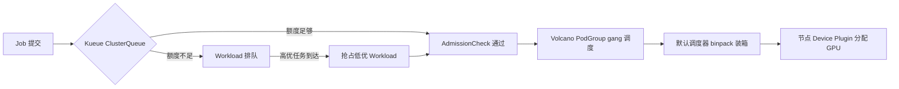

推理集群的利用率为什么普遍只有 30%-50%？大多数时候不是模型不够强，而是**调度层把 GPU 当成了「特别大号的 CPU」**。这张卡该不该给、给多少、和谁共享、抢占了谁——每一步都决定你是多跑一倍任务，还是天天看着显存碎片和排队干瞪眼。

上一篇[Linux VRAM overcommit 与显存超卖](/blog/2026/08/19/linux-vram-overcommit-kernel)讲了单机层面的显存管理，这篇往上一层：**K8s 集群里 GPU 是怎么被调度、切分和排队的**。面向要搭推理集群的 SRE / 平台工程师，从 Device Plugin 讲到 Kueue、Volcano，附可直接抄的 YAML。

{/* truncate */}

## 一、GPU 为什么不能当普通资源调度

K8s 调度器对 CPU/内存的假设是：**可分割、可抢占、可超卖**。这三个假设在 GPU 上全部不成立：

| 资源特性 | CPU/内存 | GPU |
|----------|----------|-----|
| 可分割性 | 毫核粒度任意分配 | 以「整卡」为最小分配单位（除非 MIG/vGPU） |
| 显存与算力 | 无此概念 | 两者**必须同时满足**，且显存不足 = 进程崩溃（CUDA OOM），不是限流 |
| 超卖 | 常见且可接受 | 显存超卖 = 推理进程被杀，代价是线上 P0 |
| 抢占 | 可以靠 cgroup 软限制 | 任务一旦占用 SM，抢占代价极高（上下文切换不存在的） |

所以 GPU 调度本质上是在做**离散装箱（bin packing）**：把不同规格的请求（1 卡、2 卡、8 卡、显存 N GB）塞进有限且异构的节点池。装箱问题本身是 NP-hard，调度器只能用启发式——这也是为什么后面要引入专门的调度组件。

## 二、底层机制：Device Plugin 与 extended resource

K8s 原生不认识 GPU。让节点「上报」GPU 的是 **Device Plugin**：NVIDIA 官方驱动里带一个 `nvidia-device-plugin` DaemonSet，它向 kubelet 注册，把每张卡作为 `nvidia.com/gpu` 这个 **extended resource** 上报给 API Server。

```yaml
# 让 Pod 申请一张卡，就这么简单（调度器视角）
resources:
  limits:
    nvidia.com/gpu: 1
```

但注意两个容易被忽略的细节：

1. **request 必须等于 limit**。extended resource 不支持超卖，K8s 不允许 request < limit。你只能按整卡申请，不能申请「0.3 张卡」——除非走下面说的 MIG/vGPU 把卡拆开再上报。
2. **调度器只做「数量」匹配，不做「亲和」匹配**。`nvidia.com/gpu: 1` 只保证节点上还剩 1 个可分配额度，不保证这张卡**显存够不够、和同 Pod 的其他卡是否在同一 NUMA 域**。大模型多卡推理（TP=8）如果被调度到跨节点、跨 NUMA 的卡上，NVLink 没了，性能直接腰斩。

解决跨卡拓扑问题的标准姿势是节点打标 + 亲和约束：

```yaml
# 节点打上拓扑标签
kubectl label node gpu-01 nvidia.com/gpu.memory=80 \
  nvidia.com/gpu.product=A100-SXM4-80GB

# Pod 用 nodeSelector + 拓扑键约束
nodeSelector:
  nvidia.com/gpu.product: A100-SXM4-80GB
```

再配合 `topologyManager`（kubelet 的 Topology Manager）把 CPU/NIC/GPU 的对齐策略打开，才能保证多卡 Pod 拿到的是同一张 NVSwitch 下的卡。**这一步不做，后面的调度策略都是空中楼阁。**

## 三、显存切分：MIG 与 Time-Slicing

整卡分配太浪费：一个 7B 模型推理只要 16-20GB 显存，80GB 的 A100 空着一大半。于是有了两种切分方案：

**MIG（Multi-Instance GPU，A100/H100 起）**：硬件级切分，把一张卡切成最多 7 个实例，每个实例有**独立的 SM、显存和带宽隔离**。Device Plugin 会把每个 MIG 实例上报为一个独立的 `nvidia.com/gpu`，调度器无感。

```yaml
# 节点上用 nvidia-smi 切 MIG
nvidia-smi mig -cgi 1g.10gb,2g.20gb,3g.40gb -C
```

- 优点：隔离性接近物理卡，一个实例 OOM/被抢占不影响邻居。
- 坑：MIG 与 NCCL 的集体通信不兼容（MIG 实例之间没有 NVLink 直连），**多卡训练/TP 推理不能跑在 MIG 上**；只有单卡推理、batch 服务适合。

**Time-Slicing（时间片）**：软件级共享，多 Pod 共用一张卡，按时间片轮转 SM，显存各自分配。

- 优点：简单、兼容一切 workload。
- 坑：**算力隔离为零**。一个跑满算力的 Pod 会拖垮同卡所有邻居的延迟——推理场景 P99 直接失控。只适合「算力空闲、显存占满」的 batch 任务混部。

```yaml
# 显存切分方案选型一句话
# 在线推理 + 需要隔离 → MIG（注意不能做多卡通信）
# 离线 batch + 可容忍抖动 → Time-Slicing
# 两者都不行 → 买更多卡，或上 vGPU（虚拟化层切分，NVIDIA vGPU / 阿里 cGPU）
```

顺带说一句显存超卖：无论哪种切分，**显存余量都要按峰值预留**，不要赌「模型平时用不满」。上一篇讲过的 CUDA OOM 在 K8s 里就是 Pod 崩溃 + 重启风暴，比单机场景更难排查。

## 四、调度策略：binpack、亲和与 PodOverhead

切分方案定了，接下来是**装箱策略**。默认调度器只按「节点剩余可分配数」打分，你需要在 `KubeSchedulerConfiguration` 里显式打开策略：

```yaml
apiVersion: kubescheduler.config.k8s.io/v1
kind: KubeSchedulerConfiguration
profiles:
  - schedulerName: default-scheduler
    plugins:
      score:
        enabled:
          - name: NodeResourcesFit   # 默认，按资源充足度打分
          - name: ImageLocality      # 优先已有镜像的节点
    pluginConfig:
      - name: NodeResourcesFit
        args:
          scoringStrategy:
            type: MostAllocated     # binpack：把任务往已占用的节点塞
            resources:
              - name: nvidia.com/gpu
                weight: 2
```

- `MostAllocated`（binpack）：省节点、省电，但把故障域集中了——一台节点挂了带走一片 Pod。
- `LeastAllocated`（spread）：高可用优先，但碎片多、利用率低。
- 推理集群实践：**在线服务用 spread + 反亲和（PodAntiAffinity），离线 batch 用 binpack**，混部时给在线服务打高优先级。

还有一个经常被忽略的字段：`resources.claims` 之外的 **PodOverhead**——kubelet 为 Pod 预留的额外资源。推理场景的 overhead 主要来自：

```yaml
# 每个 GPU Pod 预留的「看不到但必须有的」资源
# 1. 显存池/缓存：CUDA context 每个进程 ~200-600MB
# 2. 通信缓冲：NCCL 每卡 ~1-2GB 显存
# 3. CPU：数据预处理/解码线程，8-16 核不夸张
# 4. 页缓存：模型权重 mmap 后占用的 RAM
```

不写 overhead 的后果：调度器以为节点还剩 30GB 显存，Pod 上去瞬间 OOM。**把 overhead 写进 CRD/模板，比事后告警强一百倍。**

## 五、队列与排队：Kueue 和 Volcano

单机切分、节点装箱都搞定了，还差最后一层：**集群级别的排队与抢占**。默认调度器对「排队的 job」毫无概念——一个 8 卡 job 等不到 8 张卡，可能先被调度到 4 卡节点上卡死。

**Kueue**（目前 Kubernetes 生态最主流的队列方案，已 GA）把「排队」和「调度」解耦：`ClusterQueue` 定义资源池，`Workload` 定义任务，AdmissionCheck 通过后才真正下发到调度器。

```yaml
apiVersion: kueue.x-k8s.io/v1beta1
kind: ClusterQueue
metadata:
  name: inference-pool
spec:
  namespaceSelector: {}
  preemption:
    withinClusterQueue: LowerPriority   # 低优先级任务可被抢占
  resourceGroups:
    - coveredResources: ["nvidia.com/gpu", "cpu", "memory"]
      flavors:
        - name: a100
          resources:
            - name: nvidia.com/gpu
              nominalQuota: 32          # 队列额度：32 卡
            - name: cpu
              nominalQuota: 256
```

关键能力：**Cohort 实现多队列共享额度**（在线队列借离线队列的空闲卡）、**优先级抢占**（高优在线任务插队，低优 batch 被驱逐）、**弹性额度**（利用率低时把空闲卡临时借给其他队列）。对推理集群来说，Cohort + 抢占就是「在线稳定 + 离线填坑」的机制保证。

**Volcano** 则是另一条路线：以 `PodGroup` + gang scheduling 为核心——**要么全部 Pod 同时调度成功，要么一个都不调度**，避免死锁。训练场景（PS/Worker、all-reduce 需要全部就位）是它的主场：

```yaml
apiVersion: scheduling.volcano.sh/v1beta1
kind: PodGroup
metadata:
  name: train-job
spec:
  minMember: 8            # 8 个 Pod 全部就位才开始调度
  queue: default
```

选型建议：**纯推理集群用 Kueue（生态好、和默认调度器配合顺）；有大规模分布式训练用 Volcano（gang scheduling 是硬需求）；两个都要，可以共存——Kueue 管排队，Volcano 管 gang。**



## 六、容量规划与 QoS：三句话

1. **按「峰值并发 × 单实例显存」规划，不按「平均负载」规划**。推理的显存占用是锯齿状的，均值规划必然在高峰 OOM。
2. **给在线服务留 20% 的集群冗余**，用于故障转移和滚动发布。K8s 的滚动更新一次要双倍资源，不留冗余就是发布即故障。
3. **可观测性要量化到「卡」**：`DCGM` 导出每卡的 SM 利用率、显存利用率、温度、NVLink 带宽，配合 `descheduler`（如重平衡 binpack 碎片）做周期性重排。利用率数字不会骗人——如果集群平均 SM 利用率 < 40%，先查调度策略，别急着买卡。

## 相关阅读

- [Linux VRAM overcommit 与显存超卖内核机制](/blog/2026/08/19/linux-vram-overcommit-kernel)
- [LLM 推理性能建模：Roofline 视角](/blog/2026/08/07/llm-inference-performance-modeling)
- [vLLM 架构深读：连续批处理与 PagedAttention](/blog/2026/07/26/vllm-architecture-deep-dive)
- [Kubernetes 默认 StorageClass 与 OpenEBS 实践](/blog/2026/07/31/kubernetes-default-storageclass-openebs)
