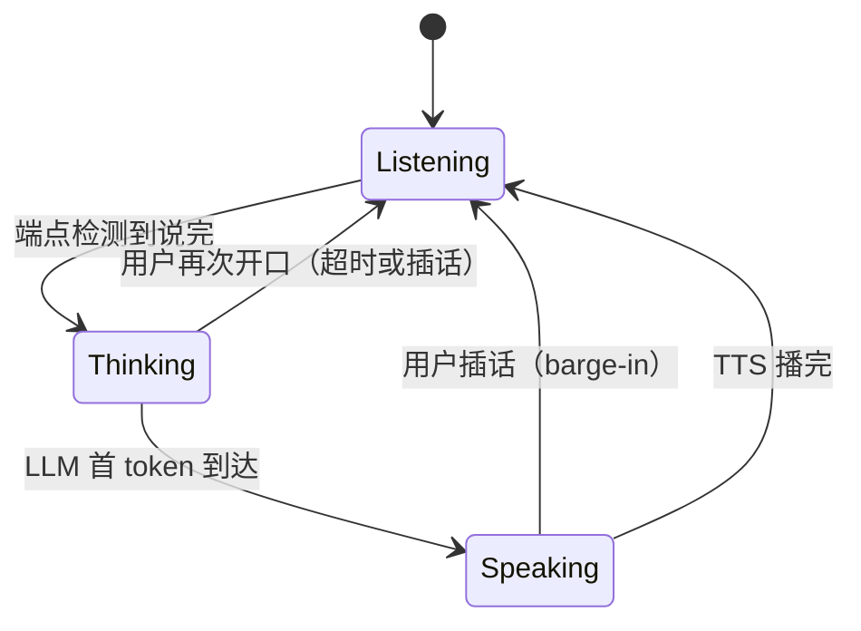

语音 Agent 和文本 Agent 的体验差距，往往不在模型智商，而在**延迟和打断**。文本场景用户等 3 秒没问题；语音场景超过 800ms 不说话，用户就会开始重复提问。而「打断」——用户中途插话——是语音交互里最高频、也最容易做砸的环节。

这篇讲语音 Agent 工程化：端到端延迟预算怎么拆、流式 ASR 的架构选择、打断（barge-in）与全双工设计。面向要自建语音链路而不是只调云 API 的工程师。上一篇[多模态 VLM 工程指南](/blog/2026/08/05/multimodal-vlm-engineering-guide)讲了视觉侧，这篇补上听觉侧。

{/* truncate */}

## 一、语音 Agent 全链路与延迟预算

一条完整的语音对话链路：**麦克风 → VAD → 流式 ASR → LLM → 流式 TTS → 扬声器**。注意这是双向并行的：ASR 在增量出结果，LLM 在思考，TTS 在出声，三者同时进行。

用户体验的硬指标是 **首响应延迟（first response latency）**：用户说完话到机器开始说话的时间。把它拆开看预算：

| 环节 | 典型预算 | 说明 |
|------|----------|------|
| VAD 端点检测（用户说完） | 100-300ms | 静音阈值 + 尾音处理，太短误切、太长拖沓 |
| ASR 流式增量（尾字到完整句） | 200-500ms | 非流式模型要等整句，流式模型可提前出 partial |
| LLM TTFT（首 token） | 300-800ms | 用 prompt caching + 小模型快响应 |
| TTS 首包（合成第一帧） | 100-300ms | 流式 TTS 边合成边播 |
| 网络/编解码 | 50-150ms | WebRTC 场景 RTP 打包 |

加起来 800ms - 2s，**每一环都要压，任何一环成为瓶颈都会拖垮整体**。实践中先量化每一环的真实耗时（全链路打 trace），再针对性优化——语音链路没有银弹，只有预算表。

## 二、VAD：最不起眼但最影响体验的组件

很多人把精力花在 ASR 上，结果发现体验差在 VAD——**它决定「什么时候开始识别」和「什么时候算说完」**。

- **WebRTC VAD**：轻量、CPU 占用极低，但只做语音/非语音二分类，噪音环境误判率高，不适合复杂场景。
- **Silero VAD**：ONNX 模型，~1ms 推理，带「概率 + 时间戳」，是目前自建链路的默认选择。核心参数 `threshold`（默认 0.5）和 `min_silence_duration_ms`（默认 100）决定灵敏度：

```python
import silero_vad

model = silero_vad.load_model()
# 关键参数调优：
# threshold 调低（0.3）→ 更灵敏，但误触发多（电视声、咳嗽）
# min_silence_duration_ms 调大（600）→ 更抗打断，但响应变慢
# 生产建议：对 8kHz/16kHz 分别校准，别用默认值上线
```

- **自研/大模型 VAD（如 FunASR 的 fsmn-vad）**：能做更细的「人声活动」分段，甚至区分多人说话，适合会议场景，但成本更高。

VAD 的工程要点是**状态机**：`silence → speech → (可能) silence → speech → 最终端点`。中间态要维护一个「尾音缓冲」（trailing buffer），用户停顿 300ms 再继续说时，不要把前面的话切掉——这是语音交互最常见的体验翻车点。

## 三、流式 ASR：模型选型与增量架构

ASR 分两派：**非流式**（等整句再识别，如 Whisper）和**流式**（边说边出 partial results）。语音 Agent 必须流式，否则延迟预算直接爆表。主流开源选择：

| 模型 | 类型 | 特点 | 适合场景 |
|------|------|------|----------|
| Whisper (large-v3) | 非流式 | 多语言、鲁棒性强，中文识别准 | 离线转写、后处理兜底 |
| WeNet / Conformer | 流式 | chunk-based attention，延迟可控 | 自建流式服务的主流选择 |
| Paraformer | 非自回归 | 一次性出整句，快且稳 | 短句场景、配合端点后识别 |
| SenseVoice | 流式 | 多语言 + 情感/事件标签，中文表现好 | 中文语音 Agent 优先试 |

架构上，流式 ASR 的核心是**增量结果协议**：每 100-200ms 产出一次 partial result（带置信度），端点后产出 final result。工程实现要注意三点：

1. **chunk 与上下文**：流式模型（如 WeNet）按 chunk 滑窗，每个 chunk 带左上下文（left context）。chunk 越小延迟越低，但准确率下降——`chunk_size=16`（160ms）是延迟与准确率的常见折中。
2. **增量文本拼接**：partial 结果之间是**追加或修订**关系，不能简单拼接。要按「已确认前缀 + 新后缀」合并，否则会出现「我今天吃」→「我今天吃苹果」→「我今天吃苹果了」的重复。
3. **ITN（逆文本正则化）**：ASR 输出「一二三四五」要转成「12345」，金额、日期、电话号都要规则化，否则 LLM 拿到「¥十二点五元」会懵。这一步放 ASR 后、LLM 前。

```text
音频流 →[每160ms]→ ASR chunk → partial("我今天吃") 
         → partial("我今天吃苹果")  ← 追加而非覆盖
         → VAD 端点 → final("我今天吃苹果了") → ITN → LLM
```

## 四、打断（Barge-in）与全双工

打断是语音 Agent 和聊天机器人最大的区别：**用户可以在 TTS 还在说话时开口**。实现打断需要三层配合：

1. **检测层**：TTS 播放时同时跑 VAD，检测到用户语音 → 触发打断信号。注意区分「用户插话」和「环境噪音」——用能量 + 语音概率双阈值。
2. **执行层**：打断信号到达后，**立即停止 TTS 播放并清空合成队列**（不是等当前句子播完！），同时告诉 ASR「重新开始一轮识别」，LLM 侧取消未完成的生成。
3. **协调层**：维护一个**对话状态机**——`listening / speaking / thinking`，任何时刻只有一个主状态，打断是状态迁移事件：



工程细节：打断时要保留用户**打断瞬间开始的新一轮语音**（用 ring buffer 缓冲最近 300-500ms 音频），否则「等等，我说的是……」的开头会被丢掉。另外，打断后 ASR 的上下文要带上被打断的 TTS 内容，LLM 才能理解「你刚才说的不对」指的是什么。

## 五、可落地的链路骨架

把以上串起来，一个自建语音 Agent 的最小骨架：

```python
class VoiceAgentPipeline:
    def __init__(self):
        self.vad = silero_vad.load_model()
        self.asr = StreamingASR(chunk_ms=160)   # 流式 ASR
        self.tts = StreamingTTS()
        self.state = "listening"

    def on_audio(self, chunk):
        if self.state == "speaking" and self.vad.is_speech(chunk):
            self.interrupt()                    # 打断：停 TTS、清队列
            self.state = "listening"
        if self.state == "listening":
            self.asr.feed(chunk)
            if partial := self.asr.partial():
                self.on_partial(partial)        # 可做实时中间反馈
            if self.asr.endpointed():
                text = itn(self.asr.final())    # 逆文本正则化
                self.state = "thinking"
                self.respond_async(text)        # LLM → TTS → speak()

    def speak(self, audio):
        self.state = "speaking"
        self.tts.play(audio)                    # 播完或被打断回到 listening
```

## 六、两个容易忽略的坑

1. **AEC（回声消除）必须做**。扬声器放出的 TTS 会被麦克风拾到，不消回声，VAD 会把自己的声音当成用户插话——Agent 自己打断自己，无限循环。WebRTC 的 AECM 或 speexdsp 是标配。
2. **多语言切换要按「句」切，不是按「人」切**。中文夹英文是常态，ASR 的语言检测（LID）要和识别并行，模型选型时优先支持 code-switching 的方案（SenseVoice、Whisper 系都比纯中文模型稳）。

语音 Agent 的工程本质是**把每个环节的延迟预算做透明、把打断的状态机做对**。模型能力在快速迭代，但这条链路的设计不会过时。

## 相关阅读

- [多模态 VLM 工程指南](/blog/2026/08/05/multimodal-vlm-engineering-guide)
- [LLM 可观测性：生产环境监控与追踪](/blog/2026/08/06/llm-observability-production)
- [Agent 记忆系统：从短期上下文到长期记忆](/blog/2026/08/13/agent-memory-system)
- [上下文工程：从 Prompt 到 Context 的工程化](/blog/2026/08/02/context-engineering-deep-dive)
