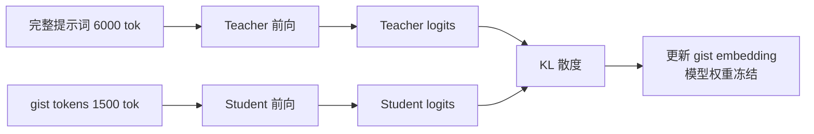

系统提示词（system prompt）正在成为 LLM 推理成本里最容易被忽略的部分。一个正经的 Agent 通常要背几十条指令、工具 schema、few-shot 示例和安全约束，动辄几千 token。**每次请求都要编码这些 token，decode 时每个生成 token 又要对它们做 attention——长度是线性成本，而吞吐是用户的账单。**

2026 年 8 月 19 日，Shopify Engineering 公开了他们在生产环境落地的一项技术：**gisting**。他们把自己的 GraphQL Agent 系统提示词从约 6000 token 压到约 1500 个 gist token（4:1 压缩），在预测质量不掉的前提下，把 350 RPM 流量下的 TTFT 从 438ms 降到 354ms（-19%）、端到端延迟从 6.8s 降到 4.2s（-38%）、吞吐从 20.2 QPS 提到 23.4 QPS（+16%），最终**少用了 14% 的 GPU**。这篇文章拆解它背后的原理、训练细节和部署方式。

{/* truncate */}

## 一、gist token 是什么

gist token 是**加入模型词表的特殊 token**。训练阶段只学这一组 token 的 embedding，模型权重全部冻结；推理阶段把完整的系统提示词替换成这串 gist token 喂给模型，行为却与看到完整提示词时高度一致。

关键点在于：**压缩发生在 embedding 空间，而不是文本空间。** 它不是摘要、不是提取关键词，而是训练出一组「语义浓缩向量」，让模型在 attention 时读到的是提示词的高密度表示。4:1 压缩意味着每 4 个原始 token 对应 1 个 gist token。

## 二、训练：知识蒸馏，冻结权重只训 embedding

训练方式是对齐蒸馏（alignment distillation）。每个训练轨迹跑两次前向：

1. **teacher pass**：模型看完整自然语言提示词，得到响应每个位置上的 logits；
2. **student pass**：把完整提示词换成 gist token，同一模型再跑一遍，得到对应的 student logits；
3. 用 **KL 散度** 让 student logits 逼近 teacher logits，只更新 gist embedding。

Shopify 用自动研究循环（autoresearch loop）调超参，其中三个优化收益最大：

- **初始化**：不随机初始化，而是把系统提示词按压缩比切成 chunk，第 n 个 gist embedding 用第 n 个 chunk 的均值初始化。仅此一项就把初始 loss 降了 **7 倍**；
- **压缩比**：4:1 是他们在该领域不损失质量的上限，其他领域各不相同；
- **数据量与多样性**：补足数据后差距才真正闭合。

训练基建上还有两个细节值得抄：loss 按**每个响应 token 平均**会让模型幻觉，改成**按 batch 平均**后长响应的信号得以保留；预计算 teacher logits + 预 tokenize 数据，把一次完整训练从 30 小时压到 6 小时。

## 三、部署：零推理开销，成本一次性付在训练期

部署极简：训练完把 gist embedding 直接写回模型的 embedding 矩阵，把 gist token 注册进 tokenizer 的特殊 token 列表。**推理侧没有任何自定义 attention mask、没有额外 encoder、没有特殊 serving 路径**——唯一的改动是请求端把提示词换成 gist token 串。

这意味着 gisting 是「训练期一次性付费，推理期永久免费」的优化，对自托管推理尤其划算：压缩成本摊薄在每一次请求上。

## 四、为什么 prefix caching 不够

有人会问：vLLM 不是有 prefix caching 吗？系统提示词不是会被缓存吗？Shopify 明确说了：**两者互补，不是替代**。

prefix caching 省的是 prefill（编码）阶段——相同前缀的 KV 直接复用，不重新计算。但它省不掉 decode 阶段的成本：每生成一个 token，这个 token 都要对序列里**每一个** key 做 attention。decode 是显存带宽瓶颈，每生成一个 token 就要把整个 KV cache 从 HBM 读一遍，**这个读取随序列长度线性增长**。gisting 直接缩小了序列长度，attention 计算量和 KV cache 读取量同比例下降——batch 越大，这个收益越明显。

生产里两个叠加：prefix caching 处理用户侧反复出现的上下文，gisting 处理固定成本最高的系统提示词。相关机制可对照此前写的 [KV Cache 优化指南](/blog/2026/08/05/kv-cache-optimization-guide) 和 [连续批处理](/blog/2026/08/11/continuous-batching-deep-dive)。

## 五、与持续学习的衔接

gisting 还天然接进持续学习循环：一旦蒸馏出 gist embedding，就可以把它当作持续学习的新起点——把 gist embedding 作为前缀做 post-train，梯度同时更新模型权重和 gist embedding。这样增量数据既能校准模型，也能校准压缩表示，**不需要每次重新蒸馏**。

## 六、工程启示

| 维度 | 结论 |
|------|------|
| 适用场景 | 系统提示词长且相对稳定（Agent 工具集、企业规范、few-shot 模板） |
| 前提 | 能访问模型权重做蒸馏训练（自托管或可微调的部署方式） |
| 收益 | Shopify 实测：TTFT -19%、E2E -38%、吞吐 +16%、GPU -14% |
| 限制 | 压缩比域相关；提示词频繁变动需要重新蒸馏；闭源 API 无法用 |
| 与缓存关系 | 与 prefix caching 叠加使用，各管一段 |

值得注意的边界：gisting 压缩的是**固定前缀**，不适合用户侧动态变化的上下文；如果系统提示词每周都在改，蒸馏成本会吃掉收益。另外它要求你有权重访问权——纯 API 调用方用不了，但这也正是自托管推理（vLLM、SGLang 等）相对闭源 API 的结构性优势之一。

## 相关阅读

- [KV Cache 优化指南：从 PagedAttention 到缓存策略](/blog/2026/08/05/kv-cache-optimization-guide)
- [连续批处理：vLLM 吞吐量提升的核心机制](/blog/2026/08/11/continuous-batching-deep-dive)
- [LLM 推理性能建模：从理论 FLOPS 到实际吞吐](/blog/2026/08/07/llm-inference-performance-modeling)

*参考：[Shopify Engineering — Gisting: Compressing LLM Agent context](https://shopify.engineering/gisting)；原始论文 Wingate, Shoeybi & Sorensen, *Prompt Compression and Contrastive Conditioning for Controllability and Toxicity Reduction in Language Models*（2022）。*
