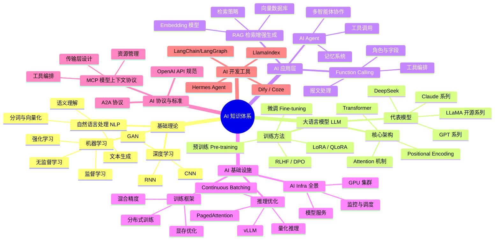

{/* 本文件由 scripts/gen-ai-topic.mjs 自动生成，请勿手工编辑。收录规则：blog/ 下带 "ai" 标签的文章，按日期倒序。 */}

# AI专题

人工智能相关文章与笔记。

## AI 知识体系

## 最新文章

- [大模型推理中的存储 I/O 瓶颈与分布式缓存优化实战](/blog/2026/07/27/llm-inference-storage-io-optimization)
- [AI Agent 推理与执行分离架构深度解析：从 ReAct 到 Plan-Execute 的演进](/blog/2026/07/27/agent-reasoning-execution-separation)
- [vLLM 架构详解：PagedAttention、Continuous Batching 与生产级推理优化](/blog/2026/07/26/vllm-architecture-deep-dive)
- [MCP 协议深度解析：架构设计、传输层与工具编排最佳实践](/blog/2026/07/26/mcp-protocol-deep-dive)
- [AI 更擅长写 React 还是 Vue？被榜单掩盖的真相](/blog/2026/07/24/ai-react-vs-vue)
- [Function Calling 实践指南：角色、字段与报文处理全解析](/blog/2026/07/23/function-calling-implementation-guide)
- [扩展 LLM 的能力边界：联网搜索、文件读写与记忆功能全景指南](/blog/2026/07/23/extending-llm-capabilities)
- [一文讲透如何构建 Harness——六大组件全解析](/blog/2026/07/16/harness-six-components)
- [Windows VSCode 调用 WSL 中的 Hermes Agent 实战](/blog/2026/07/15/vscode-wsl-hermes)
- [HyperFrames 视频脚本：GB200 NVL72 — 一台 300 万美元的 AI 机柜，钱到底花在哪？](/blog/2026/07/14/gb200-nvl72-cost-breakdown)
- [Function Calling 诞生的背景：LLM 为什么要学会调用函数](/blog/2026/07/14/function-calling-background)
- [DeepSeek开源的价值](/blog/2026/07/13/deepseek-open-source-value)
- [AI Infra 到底是什么](/blog/2026/07/07/ai-infra-what-is-it)
- [用 LangChain + Qdrant + DeepSeek 搭建简历 RAG 系统](/blog/2026/07/03/rag-with-langchain-qdrant)
