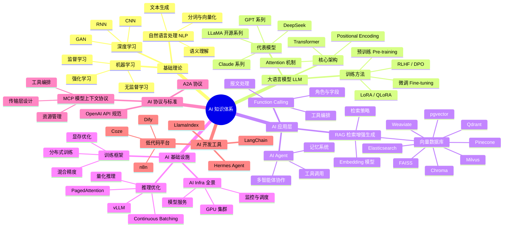

{/* 本文件由 scripts/gen-ai-topic.mjs 自动生成，请勿手工编辑。收录规则：blog/ 下带 "ai" 标签的文章，按日期倒序。 */}

# AI专题

人工智能相关文章与笔记。

## AI 知识体系

## 最新文章

- [Cursor Origin 上线：AI 时代代码托管的三个信号与工程反思](/blog/2026/08/19/cursor-origin-code-hosting)
- [Linux 7.3 的 VRAM Overcommit：显存不够用时，内核级兜底怎么做](/blog/2026/08/19/linux-vram-overcommit-kernel)
- [面试题：KV Cache 是什么？为什么长上下文推理显存不够用？](/blog/2026/08/19/kv-cache-interview)
- [KV Cache 深度解析：显存黑洞、PagedAttention 与三路省内存方案](/blog/2026/08/18/kv-cache-pagedattention-deep-dive)
- [Snowflake Jira 被攻破始末：Copilot Autofix 合入的 GitHub Actions 注入漏洞与 AI 代码治理](/blog/2026/08/18/copilot-autofix-github-actions-injection)
- [GLM-5.3 与 Coding Agent 的安全能力：白盒审计、漏洞推理与证据分级](/blog/2026/08/17/glm53-coding-agent-security)
- [Embedding 进阶：Matryoshka 表示学习、量化向量与检索调优，把 RAG 的存储和延迟砍一个数量级](/blog/2026/08/17/embedding-matryoshka-quantization)
- [Qwen3.8-27B 架构深读：Gated DeltaNet 混合线性注意力与 262K 长上下文](/blog/2026/08/17/qwen38-27b-gated-deltanet-hybrid-attention)
- [LoRA/QLoRA 参数高效微调实战：低秩假设、NF4 双重量化与多 Adapter 生产部署](/blog/2026/08/16/lora-qlora-peft-deep-dive)
- [多 Agent 协作架构：Orchestrator-Worker 之外，任务依赖图、上下文隔离与结果合并的工程实践](/blog/2026/08/16/multi-agent-orchestration)
- [A2A 协议深挖：Agent 之间怎么协作？AgentCard、Task 状态机与 SSE 流式传输全解析](/blog/2026/08/15/a2a-protocol-deep-dive)
- [RAG 检索优化深度拆解：分块策略到 Cross-Encoder 重排序，召回率提升的完整链路](/blog/2026/08/15/rag-chunking-rerank-deep-dive)
- [LLM 量化深度拆解：4-bit 省 75% 显存，GPTQ / AWQ / GGUF / NF4 怎么选](/blog/2026/08/14/llm-quantization-deep-dive)
- [大模型 Agent 的记忆系统：从上下文窗口到长期记忆的完整设计](/blog/2026/08/13/agent-memory-system)
- [为什么标准 Attention 的 O(n²) 绕不开？softmax 全局归一化才是数学根源](/blog/2026/08/13/attention-n2-softmax-mathematical-origin)
- [面试题：为什么 Attention 是 O(n²)？Linear Attention 和 FlashAttention 分别解决了什么问题？](/blog/2026/08/13/linear-attention-flashattention-interview)
- [从 RLHF 到 GRPO：大模型对齐训练技术演进与实战](/blog/2026/08/12/grpo-alignment-training-evolution)
- [AI 应用向量数据库选型：Milvus、Pinecone、Qdrant、Chroma 等对比](/blog/2026/08/12/vector-database-comparison)
- [拆解 Function Calling：大模型工具调用的全链路与坑](/blog/2026/08/11/function-calling-internals)
- [Continuous Batching 深度解析：为什么 LLM 推理不能用传统 Request Batching](/blog/2026/08/11/continuous-batching-deep-dive)
- [LLM 结构化输出实战：从 Prompt Engineering 到 Constrained Decoding](/blog/2026/08/10/structured-output-techniques)
- [面试题：Transformer 的 Attention 机制为什么用缩放点积，而不是直接点积？](/blog/2026/08/10/transformer-attention-scaling-interview)
- [LLM 推理性能建模：用 Roofline 模型回答『需要多少张卡』](/blog/2026/08/07/llm-inference-performance-modeling)
- [投机解码深度解析：草稿模型如何把推理吞吐提升 2-3 倍](/blog/2026/08/06/speculative-decoding-deep-dive)
- [LLM 应用可观测性工程：从 token 账单到 Agent 轨迹追踪](/blog/2026/08/06/llm-observability-production)
- [多模态大模型工程实践：视觉 token、动态分辨率与推理部署](/blog/2026/08/05/multimodal-vlm-engineering-guide)
- [KV Cache 优化实战：长上下文推理的内存、量化与驱逐](/blog/2026/08/05/kv-cache-optimization-guide)
- [LLM 评测的工程化：从基准分数到 LLM-as-a-Judge 的生产实践](/blog/2026/08/04/llm-eval-llm-as-judge)
- [大模型分布式训练的并行策略：从数据并行到 3D 并行与专家并行](/blog/2026/08/04/distributed-training-parallelism)
- [LLM 路由的工程真相：大家都在做，为什么 Manifest 下线了自己的路由器？](/blog/2026/08/03/llm-router-engineering-lessons)
- [Agent 入侵事件技术复盘：Hugging Face 七月入侵全链条解析](/blog/2026/08/03/hf-agent-intrusion-analysis)
- [improve-codebase-architecture：用「深模块」给代码库做一次架构体检](/blog/2026/08/02/improve-codebase-architecture-skill)
- [上下文工程：把 Context 当作一等资源来管理](/blog/2026/08/02/context-engineering-deep-dive)
- [MCP 2026-07-28 规范解读：无状态核心与协议的成人礼](/blog/2026/08/01/mcp-spec-stateless-core)
- [DeepSeek V4 Flash 0731 解析：智能指数 50 的 284B MoE 性价比之王](/blog/2026/08/01/deepseek-v4-flash-analysis)
- [AI 编程的现实主义：为什么是 2x 而不是 10x——兼谈重构的 Token 经济学](/blog/2026/07/31/llm-coding-2x-not-10x)
- [GPT-5.6 价格-性能革命：Luna 降价 80% 背后的推理效率工程](/blog/2026/07/31/gpt-5-6-price-performance-analysis)
- [LLM 量化技术实战指南：从 FP8 到 INT4 的生产级优化](/blog/2026/07/30/llm-quantization-production-guide)
- [AI Agent 工程化实践：构建可观测、可管控的生产级智能体系统](/blog/2026/07/30/agent-engineering-production-guide)
- [HotPin：用控制理论思维突破 MoE 模型的推理内存墙](/blog/2026/07/29/hotpin-lossless-moe-inference)
- [Kimi-K3 深度解析：2.8T 开源 MoE 模型的架构创新与设计哲学](/blog/2026/07/29/kimi-k3-architecture-analysis)
- [推理模型的计算效率革命：Early Stopping 与自适应推理时延优化](/blog/2026/07/28/reasoning-model-early-stopping)
- [Agent 安全防护：ToolGuardian 深度解析](/blog/2026/07/28/agent-security-toolguardian)
- [LLM 推理中的存储 I/O 优化：从 HDD 到 CXL 的演进](/blog/2026/07/27/llm-inference-storage-io-optimization)
- [Agent 推理与执行分离：构建可维护的 AI 智能体架构](/blog/2026/07/27/agent-reasoning-execution-separation)
- [vLLM 架构详解：PagedAttention、Continuous Batching 与生产级推理优化](/blog/2026/07/26/vllm-architecture-deep-dive)
- [MCP 协议深度解析：架构设计、传输层与工具编排最佳实践](/blog/2026/07/26/mcp-protocol-deep-dive)
- [AI 更擅长写 React 还是 Vue？被榜单掩盖的真相](/blog/2026/07/24/ai-react-vs-vue)
- [Function Calling 实践指南：角色、字段与报文处理全解析](/blog/2026/07/23/function-calling-implementation-guide)
- [扩展 LLM 的能力边界：联网搜索、文件读写与记忆功能全景指南](/blog/2026/07/23/extending-llm-capabilities)
- [一文讲透如何构建 Harness——六大组件全解析](/blog/2026/07/16/harness-six-components)
- [Windows VSCode 调用 WSL 中的 Hermes Agent 实战](/blog/2026/07/15/vscode-wsl-hermes)
- [HyperFrames 视频脚本：GB200 NVL72 — 一台 300 万美元的 AI 机柜，钱到底花在哪？](/blog/2026/07/14/gb200-nvl72-cost-breakdown)
- [Function Calling 诞生的背景：从 LLM 聊天到工具调用](/blog/2026/07/14/function-calling-background)
- [DeepSeek开源的价值](/blog/2026/07/13/deepseek-open-source-value)
- [AI Infra 到底是什么](/blog/2026/07/07/ai-infra-what-is-it)
- [用 LangChain + Qdrant + DeepSeek 搭建简历 RAG 系统](/blog/2026/07/03/rag-with-langchain-qdrant)
