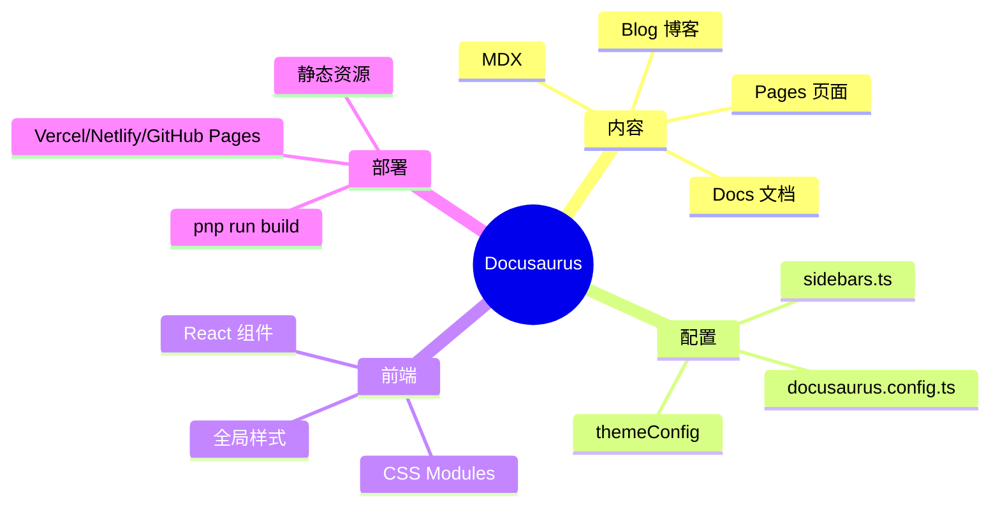

---
title: Markdown page example
---

# Markdown page example

You don't need React to write simple standalone pages.

## Docusaurus 思维导图

```mermaid
mindmap
    root((Docusaurus))
        内容
            Docs 文档
            Blog 博客
            Pages 页面
            MDX
        配置
            docusaurus.config.ts
            sidebars.ts
            themeConfig
        前端
            React 组件
            CSS Modules
            全局样式
        部署
            pnp run build
            静态资源
            Vercel/Netlify/GitHub Pages
```
